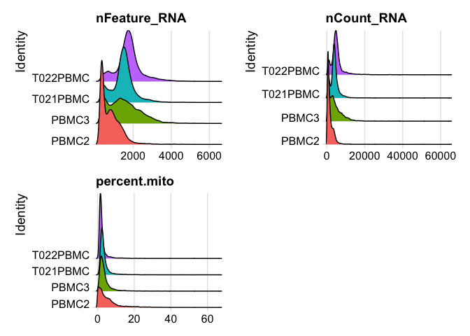
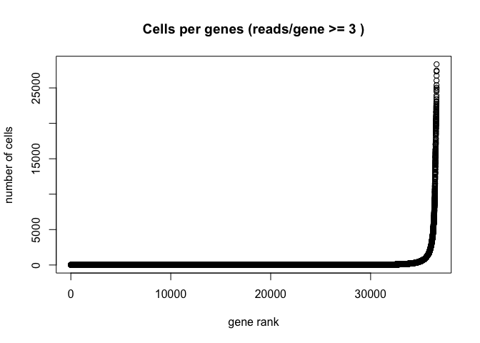
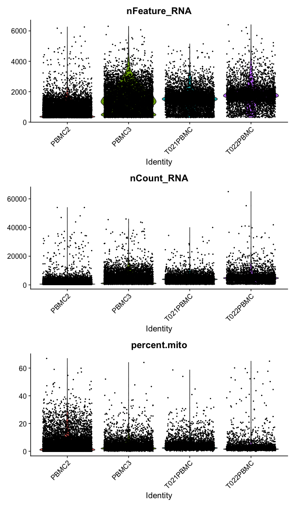
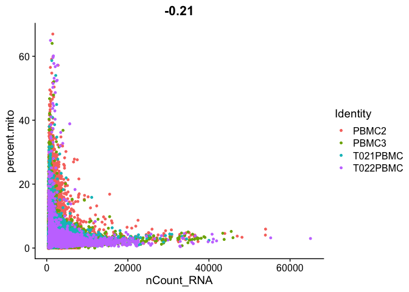
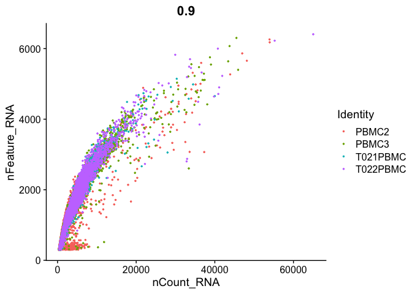
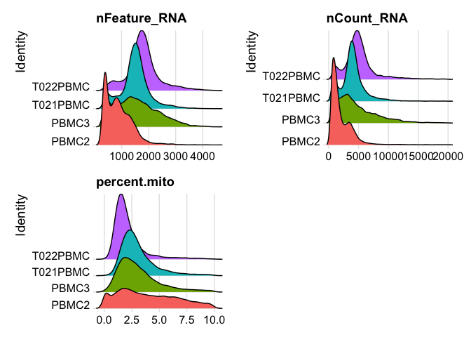
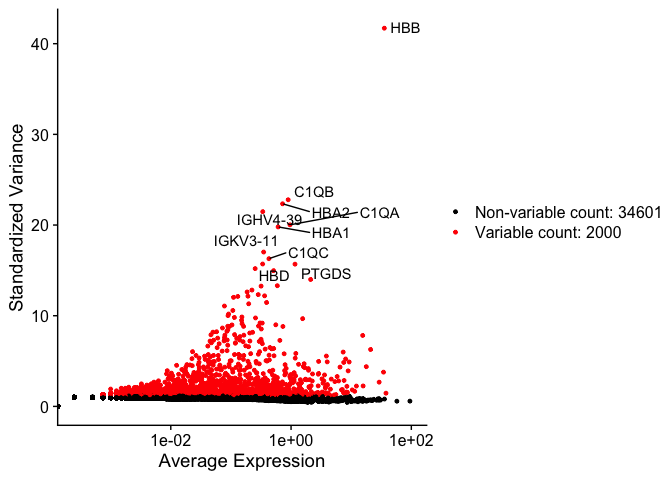

## Load libraries

```r
library(Seurat)
library(biomaRt)
library(knitr)
library(kableExtra)
```

## Load the Seurat object from part 1

```r
load(file="original_seurat_object.RData")
experiment.aggregate
```

```
## An object of class Seurat 
## 36601 features across 29696 samples within 1 assay 
## Active assay: RNA (36601 features, 0 variable features)
```

## Some basic QA/QC of the metadata, print tables of the 5% quantiles.

Show 5% quantiles for number of genes per cell per sample

```r
kable(do.call("cbind", tapply(experiment.aggregate$nFeature_RNA, 
                      Idents(experiment.aggregate),quantile,probs=seq(0,1,0.05))),
      caption = "5% Quantiles of Genes/Cell by Sample") %>% kable_styling()
```

<table class="table" style="margin-left: auto; margin-right: auto;">
<caption>5% Quantiles of Genes/Cell by Sample</caption>
 <thead>
  <tr>
   <th style="text-align:left;">   </th>
   <th style="text-align:right;"> PBMC2 </th>
   <th style="text-align:right;"> PBMC3 </th>
   <th style="text-align:right;"> T021PBMC </th>
   <th style="text-align:right;"> T022PBMC </th>
  </tr>
 </thead>
<tbody>
  <tr>
   <td style="text-align:left;"> 0% </td>
   <td style="text-align:right;"> 300.0 </td>
   <td style="text-align:right;"> 300.00 </td>
   <td style="text-align:right;"> 300.0 </td>
   <td style="text-align:right;"> 300.00 </td>
  </tr>
  <tr>
   <td style="text-align:left;"> 5% </td>
   <td style="text-align:right;"> 311.0 </td>
   <td style="text-align:right;"> 364.00 </td>
   <td style="text-align:right;"> 445.0 </td>
   <td style="text-align:right;"> 618.35 </td>
  </tr>
  <tr>
   <td style="text-align:left;"> 10% </td>
   <td style="text-align:right;"> 321.0 </td>
   <td style="text-align:right;"> 459.30 </td>
   <td style="text-align:right;"> 598.0 </td>
   <td style="text-align:right;"> 884.40 </td>
  </tr>
  <tr>
   <td style="text-align:left;"> 15% </td>
   <td style="text-align:right;"> 334.0 </td>
   <td style="text-align:right;"> 563.00 </td>
   <td style="text-align:right;"> 808.0 </td>
   <td style="text-align:right;"> 1181.20 </td>
  </tr>
  <tr>
   <td style="text-align:left;"> 20% </td>
   <td style="text-align:right;"> 347.0 </td>
   <td style="text-align:right;"> 678.60 </td>
   <td style="text-align:right;"> 1030.0 </td>
   <td style="text-align:right;"> 1356.40 </td>
  </tr>
  <tr>
   <td style="text-align:left;"> 25% </td>
   <td style="text-align:right;"> 365.0 </td>
   <td style="text-align:right;"> 825.00 </td>
   <td style="text-align:right;"> 1190.0 </td>
   <td style="text-align:right;"> 1452.00 </td>
  </tr>
  <tr>
   <td style="text-align:left;"> 30% </td>
   <td style="text-align:right;"> 393.0 </td>
   <td style="text-align:right;"> 969.90 </td>
   <td style="text-align:right;"> 1276.0 </td>
   <td style="text-align:right;"> 1527.00 </td>
  </tr>
  <tr>
   <td style="text-align:left;"> 35% </td>
   <td style="text-align:right;"> 439.0 </td>
   <td style="text-align:right;"> 1091.00 </td>
   <td style="text-align:right;"> 1334.0 </td>
   <td style="text-align:right;"> 1588.00 </td>
  </tr>
  <tr>
   <td style="text-align:left;"> 40% </td>
   <td style="text-align:right;"> 509.0 </td>
   <td style="text-align:right;"> 1207.00 </td>
   <td style="text-align:right;"> 1390.0 </td>
   <td style="text-align:right;"> 1646.00 </td>
  </tr>
  <tr>
   <td style="text-align:left;"> 45% </td>
   <td style="text-align:right;"> 613.0 </td>
   <td style="text-align:right;"> 1312.00 </td>
   <td style="text-align:right;"> 1438.0 </td>
   <td style="text-align:right;"> 1695.00 </td>
  </tr>
  <tr>
   <td style="text-align:left;"> 50% </td>
   <td style="text-align:right;"> 697.0 </td>
   <td style="text-align:right;"> 1412.00 </td>
   <td style="text-align:right;"> 1481.0 </td>
   <td style="text-align:right;"> 1741.00 </td>
  </tr>
  <tr>
   <td style="text-align:left;"> 55% </td>
   <td style="text-align:right;"> 772.0 </td>
   <td style="text-align:right;"> 1521.65 </td>
   <td style="text-align:right;"> 1528.0 </td>
   <td style="text-align:right;"> 1788.85 </td>
  </tr>
  <tr>
   <td style="text-align:left;"> 60% </td>
   <td style="text-align:right;"> 842.0 </td>
   <td style="text-align:right;"> 1629.80 </td>
   <td style="text-align:right;"> 1573.0 </td>
   <td style="text-align:right;"> 1843.00 </td>
  </tr>
  <tr>
   <td style="text-align:left;"> 65% </td>
   <td style="text-align:right;"> 920.0 </td>
   <td style="text-align:right;"> 1753.00 </td>
   <td style="text-align:right;"> 1620.0 </td>
   <td style="text-align:right;"> 1894.55 </td>
  </tr>
  <tr>
   <td style="text-align:left;"> 70% </td>
   <td style="text-align:right;"> 1000.0 </td>
   <td style="text-align:right;"> 1883.10 </td>
   <td style="text-align:right;"> 1668.3 </td>
   <td style="text-align:right;"> 1950.90 </td>
  </tr>
  <tr>
   <td style="text-align:left;"> 75% </td>
   <td style="text-align:right;"> 1100.0 </td>
   <td style="text-align:right;"> 2022.00 </td>
   <td style="text-align:right;"> 1726.0 </td>
   <td style="text-align:right;"> 2021.00 </td>
  </tr>
  <tr>
   <td style="text-align:left;"> 80% </td>
   <td style="text-align:right;"> 1211.0 </td>
   <td style="text-align:right;"> 2212.00 </td>
   <td style="text-align:right;"> 1802.0 </td>
   <td style="text-align:right;"> 2114.00 </td>
  </tr>
  <tr>
   <td style="text-align:left;"> 85% </td>
   <td style="text-align:right;"> 1327.0 </td>
   <td style="text-align:right;"> 2395.00 </td>
   <td style="text-align:right;"> 1905.0 </td>
   <td style="text-align:right;"> 2252.95 </td>
  </tr>
  <tr>
   <td style="text-align:left;"> 90% </td>
   <td style="text-align:right;"> 1473.0 </td>
   <td style="text-align:right;"> 2641.00 </td>
   <td style="text-align:right;"> 2075.1 </td>
   <td style="text-align:right;"> 2508.00 </td>
  </tr>
  <tr>
   <td style="text-align:left;"> 95% </td>
   <td style="text-align:right;"> 1717.7 </td>
   <td style="text-align:right;"> 2997.70 </td>
   <td style="text-align:right;"> 2451.0 </td>
   <td style="text-align:right;"> 3013.25 </td>
  </tr>
  <tr>
   <td style="text-align:left;"> 100% </td>
   <td style="text-align:right;"> 6260.0 </td>
   <td style="text-align:right;"> 6303.00 </td>
   <td style="text-align:right;"> 5145.0 </td>
   <td style="text-align:right;"> 6407.00 </td>
  </tr>
</tbody>
</table>

Show 5% quantiles for number of UMI per cell per sample

```r
kable(do.call("cbind", tapply(experiment.aggregate$nCount_RNA, 
                                      Idents(experiment.aggregate),quantile,probs=seq(0,1,0.05))),
      caption = "5% Quantiles of UMI/Cell by Sample") %>% kable_styling()
```

<table class="table" style="margin-left: auto; margin-right: auto;">
<caption>5% Quantiles of UMI/Cell by Sample</caption>
 <thead>
  <tr>
   <th style="text-align:left;">   </th>
   <th style="text-align:right;"> PBMC2 </th>
   <th style="text-align:right;"> PBMC3 </th>
   <th style="text-align:right;"> T021PBMC </th>
   <th style="text-align:right;"> T022PBMC </th>
  </tr>
 </thead>
<tbody>
  <tr>
   <td style="text-align:left;"> 0% </td>
   <td style="text-align:right;"> 364.00 </td>
   <td style="text-align:right;"> 387.00 </td>
   <td style="text-align:right;"> 408.00 </td>
   <td style="text-align:right;"> 415.00 </td>
  </tr>
  <tr>
   <td style="text-align:left;"> 5% </td>
   <td style="text-align:right;"> 431.00 </td>
   <td style="text-align:right;"> 616.15 </td>
   <td style="text-align:right;"> 700.00 </td>
   <td style="text-align:right;"> 1068.40 </td>
  </tr>
  <tr>
   <td style="text-align:left;"> 10% </td>
   <td style="text-align:right;"> 455.00 </td>
   <td style="text-align:right;"> 797.00 </td>
   <td style="text-align:right;"> 1020.00 </td>
   <td style="text-align:right;"> 1673.40 </td>
  </tr>
  <tr>
   <td style="text-align:left;"> 15% </td>
   <td style="text-align:right;"> 482.00 </td>
   <td style="text-align:right;"> 1008.00 </td>
   <td style="text-align:right;"> 1514.00 </td>
   <td style="text-align:right;"> 2617.15 </td>
  </tr>
  <tr>
   <td style="text-align:left;"> 20% </td>
   <td style="text-align:right;"> 513.00 </td>
   <td style="text-align:right;"> 1287.00 </td>
   <td style="text-align:right;"> 2235.00 </td>
   <td style="text-align:right;"> 3268.20 </td>
  </tr>
  <tr>
   <td style="text-align:left;"> 25% </td>
   <td style="text-align:right;"> 556.25 </td>
   <td style="text-align:right;"> 1640.25 </td>
   <td style="text-align:right;"> 2808.00 </td>
   <td style="text-align:right;"> 3648.75 </td>
  </tr>
  <tr>
   <td style="text-align:left;"> 30% </td>
   <td style="text-align:right;"> 630.00 </td>
   <td style="text-align:right;"> 2024.00 </td>
   <td style="text-align:right;"> 3135.00 </td>
   <td style="text-align:right;"> 3923.10 </td>
  </tr>
  <tr>
   <td style="text-align:left;"> 35% </td>
   <td style="text-align:right;"> 745.55 </td>
   <td style="text-align:right;"> 2389.05 </td>
   <td style="text-align:right;"> 3348.00 </td>
   <td style="text-align:right;"> 4157.45 </td>
  </tr>
  <tr>
   <td style="text-align:left;"> 40% </td>
   <td style="text-align:right;"> 894.00 </td>
   <td style="text-align:right;"> 2743.40 </td>
   <td style="text-align:right;"> 3520.00 </td>
   <td style="text-align:right;"> 4363.80 </td>
  </tr>
  <tr>
   <td style="text-align:left;"> 45% </td>
   <td style="text-align:right;"> 1035.00 </td>
   <td style="text-align:right;"> 3066.35 </td>
   <td style="text-align:right;"> 3682.05 </td>
   <td style="text-align:right;"> 4559.15 </td>
  </tr>
  <tr>
   <td style="text-align:left;"> 50% </td>
   <td style="text-align:right;"> 1156.00 </td>
   <td style="text-align:right;"> 3398.50 </td>
   <td style="text-align:right;"> 3830.00 </td>
   <td style="text-align:right;"> 4752.00 </td>
  </tr>
  <tr>
   <td style="text-align:left;"> 55% </td>
   <td style="text-align:right;"> 1286.00 </td>
   <td style="text-align:right;"> 3784.65 </td>
   <td style="text-align:right;"> 3973.00 </td>
   <td style="text-align:right;"> 4930.85 </td>
  </tr>
  <tr>
   <td style="text-align:left;"> 60% </td>
   <td style="text-align:right;"> 1451.00 </td>
   <td style="text-align:right;"> 4210.80 </td>
   <td style="text-align:right;"> 4125.40 </td>
   <td style="text-align:right;"> 5121.20 </td>
  </tr>
  <tr>
   <td style="text-align:left;"> 65% </td>
   <td style="text-align:right;"> 1659.00 </td>
   <td style="text-align:right;"> 4684.95 </td>
   <td style="text-align:right;"> 4293.85 </td>
   <td style="text-align:right;"> 5336.20 </td>
  </tr>
  <tr>
   <td style="text-align:left;"> 70% </td>
   <td style="text-align:right;"> 1936.10 </td>
   <td style="text-align:right;"> 5279.00 </td>
   <td style="text-align:right;"> 4483.00 </td>
   <td style="text-align:right;"> 5582.00 </td>
  </tr>
  <tr>
   <td style="text-align:left;"> 75% </td>
   <td style="text-align:right;"> 2315.75 </td>
   <td style="text-align:right;"> 5940.75 </td>
   <td style="text-align:right;"> 4696.50 </td>
   <td style="text-align:right;"> 5847.25 </td>
  </tr>
  <tr>
   <td style="text-align:left;"> 80% </td>
   <td style="text-align:right;"> 2810.00 </td>
   <td style="text-align:right;"> 6852.80 </td>
   <td style="text-align:right;"> 4989.00 </td>
   <td style="text-align:right;"> 6211.20 </td>
  </tr>
  <tr>
   <td style="text-align:left;"> 85% </td>
   <td style="text-align:right;"> 3373.15 </td>
   <td style="text-align:right;"> 7873.65 </td>
   <td style="text-align:right;"> 5468.30 </td>
   <td style="text-align:right;"> 6772.75 </td>
  </tr>
  <tr>
   <td style="text-align:left;"> 90% </td>
   <td style="text-align:right;"> 3905.40 </td>
   <td style="text-align:right;"> 9212.70 </td>
   <td style="text-align:right;"> 6174.10 </td>
   <td style="text-align:right;"> 7907.60 </td>
  </tr>
  <tr>
   <td style="text-align:left;"> 95% </td>
   <td style="text-align:right;"> 4857.35 </td>
   <td style="text-align:right;"> 11522.20 </td>
   <td style="text-align:right;"> 7717.55 </td>
   <td style="text-align:right;"> 10940.50 </td>
  </tr>
  <tr>
   <td style="text-align:left;"> 100% </td>
   <td style="text-align:right;"> 53960.00 </td>
   <td style="text-align:right;"> 45925.00 </td>
   <td style="text-align:right;"> 40004.00 </td>
   <td style="text-align:right;"> 65032.00 </td>
  </tr>
</tbody>
</table>

Show 5% quantiles for number of mitochondrial percentage per cell per sample

```r
kable(round(do.call("cbind", tapply(experiment.aggregate$percent.mito, Idents(experiment.aggregate),quantile,probs=seq(0,1,0.05))), digits = 3),
      caption = "5% Quantiles of Percent Mitochondria by Sample") %>% kable_styling()
```

<table class="table" style="margin-left: auto; margin-right: auto;">
<caption>5% Quantiles of Percent Mitochondria by Sample</caption>
 <thead>
  <tr>
   <th style="text-align:left;">   </th>
   <th style="text-align:right;"> PBMC2 </th>
   <th style="text-align:right;"> PBMC3 </th>
   <th style="text-align:right;"> T021PBMC </th>
   <th style="text-align:right;"> T022PBMC </th>
  </tr>
 </thead>
<tbody>
  <tr>
   <td style="text-align:left;"> 0% </td>
   <td style="text-align:right;"> 0.000 </td>
   <td style="text-align:right;"> 0.000 </td>
   <td style="text-align:right;"> 0.000 </td>
   <td style="text-align:right;"> 0.000 </td>
  </tr>
  <tr>
   <td style="text-align:left;"> 5% </td>
   <td style="text-align:right;"> 0.170 </td>
   <td style="text-align:right;"> 0.901 </td>
   <td style="text-align:right;"> 1.297 </td>
   <td style="text-align:right;"> 0.857 </td>
  </tr>
  <tr>
   <td style="text-align:left;"> 10% </td>
   <td style="text-align:right;"> 0.433 </td>
   <td style="text-align:right;"> 1.193 </td>
   <td style="text-align:right;"> 1.544 </td>
   <td style="text-align:right;"> 1.025 </td>
  </tr>
  <tr>
   <td style="text-align:left;"> 15% </td>
   <td style="text-align:right;"> 0.760 </td>
   <td style="text-align:right;"> 1.450 </td>
   <td style="text-align:right;"> 1.736 </td>
   <td style="text-align:right;"> 1.137 </td>
  </tr>
  <tr>
   <td style="text-align:left;"> 20% </td>
   <td style="text-align:right;"> 1.107 </td>
   <td style="text-align:right;"> 1.627 </td>
   <td style="text-align:right;"> 1.894 </td>
   <td style="text-align:right;"> 1.247 </td>
  </tr>
  <tr>
   <td style="text-align:left;"> 25% </td>
   <td style="text-align:right;"> 1.452 </td>
   <td style="text-align:right;"> 1.811 </td>
   <td style="text-align:right;"> 2.033 </td>
   <td style="text-align:right;"> 1.341 </td>
  </tr>
  <tr>
   <td style="text-align:left;"> 30% </td>
   <td style="text-align:right;"> 1.795 </td>
   <td style="text-align:right;"> 1.996 </td>
   <td style="text-align:right;"> 2.183 </td>
   <td style="text-align:right;"> 1.431 </td>
  </tr>
  <tr>
   <td style="text-align:left;"> 35% </td>
   <td style="text-align:right;"> 2.144 </td>
   <td style="text-align:right;"> 2.187 </td>
   <td style="text-align:right;"> 2.317 </td>
   <td style="text-align:right;"> 1.523 </td>
  </tr>
  <tr>
   <td style="text-align:left;"> 40% </td>
   <td style="text-align:right;"> 2.560 </td>
   <td style="text-align:right;"> 2.376 </td>
   <td style="text-align:right;"> 2.450 </td>
   <td style="text-align:right;"> 1.609 </td>
  </tr>
  <tr>
   <td style="text-align:left;"> 45% </td>
   <td style="text-align:right;"> 3.045 </td>
   <td style="text-align:right;"> 2.577 </td>
   <td style="text-align:right;"> 2.583 </td>
   <td style="text-align:right;"> 1.700 </td>
  </tr>
  <tr>
   <td style="text-align:left;"> 50% </td>
   <td style="text-align:right;"> 3.598 </td>
   <td style="text-align:right;"> 2.795 </td>
   <td style="text-align:right;"> 2.731 </td>
   <td style="text-align:right;"> 1.798 </td>
  </tr>
  <tr>
   <td style="text-align:left;"> 55% </td>
   <td style="text-align:right;"> 4.193 </td>
   <td style="text-align:right;"> 3.010 </td>
   <td style="text-align:right;"> 2.893 </td>
   <td style="text-align:right;"> 1.902 </td>
  </tr>
  <tr>
   <td style="text-align:left;"> 60% </td>
   <td style="text-align:right;"> 4.878 </td>
   <td style="text-align:right;"> 3.268 </td>
   <td style="text-align:right;"> 3.060 </td>
   <td style="text-align:right;"> 2.028 </td>
  </tr>
  <tr>
   <td style="text-align:left;"> 65% </td>
   <td style="text-align:right;"> 5.556 </td>
   <td style="text-align:right;"> 3.548 </td>
   <td style="text-align:right;"> 3.261 </td>
   <td style="text-align:right;"> 2.167 </td>
  </tr>
  <tr>
   <td style="text-align:left;"> 70% </td>
   <td style="text-align:right;"> 6.326 </td>
   <td style="text-align:right;"> 3.865 </td>
   <td style="text-align:right;"> 3.505 </td>
   <td style="text-align:right;"> 2.337 </td>
  </tr>
  <tr>
   <td style="text-align:left;"> 75% </td>
   <td style="text-align:right;"> 7.135 </td>
   <td style="text-align:right;"> 4.287 </td>
   <td style="text-align:right;"> 3.810 </td>
   <td style="text-align:right;"> 2.560 </td>
  </tr>
  <tr>
   <td style="text-align:left;"> 80% </td>
   <td style="text-align:right;"> 8.255 </td>
   <td style="text-align:right;"> 4.831 </td>
   <td style="text-align:right;"> 4.220 </td>
   <td style="text-align:right;"> 2.841 </td>
  </tr>
  <tr>
   <td style="text-align:left;"> 85% </td>
   <td style="text-align:right;"> 9.867 </td>
   <td style="text-align:right;"> 5.667 </td>
   <td style="text-align:right;"> 4.785 </td>
   <td style="text-align:right;"> 3.369 </td>
  </tr>
  <tr>
   <td style="text-align:left;"> 90% </td>
   <td style="text-align:right;"> 13.351 </td>
   <td style="text-align:right;"> 7.015 </td>
   <td style="text-align:right;"> 5.807 </td>
   <td style="text-align:right;"> 4.363 </td>
  </tr>
  <tr>
   <td style="text-align:left;"> 95% </td>
   <td style="text-align:right;"> 19.802 </td>
   <td style="text-align:right;"> 9.943 </td>
   <td style="text-align:right;"> 8.575 </td>
   <td style="text-align:right;"> 7.221 </td>
  </tr>
  <tr>
   <td style="text-align:left;"> 100% </td>
   <td style="text-align:right;"> 66.956 </td>
   <td style="text-align:right;"> 64.033 </td>
   <td style="text-align:right;"> 58.654 </td>
   <td style="text-align:right;"> 64.962 </td>
  </tr>
</tbody>
</table>

plot ridgeplots of the same data


```r
RidgePlot(experiment.aggregate, features=c("nFeature_RNA","nCount_RNA", "percent.mito"), ncol = 2)
```

```
## Picking joint bandwidth of 84.3
```

```
## Picking joint bandwidth of 289
```

```
## Picking joint bandwidth of 0.311
```

<!-- -->


Plot the number of cells each gene is represented by

```r
plot(sort(Matrix::rowSums(GetAssayData(experiment.aggregate) >= 3)) , xlab="gene rank", ylab="number of cells", main="Cells per genes (reads/gene >= 3 )")
```

<!-- -->

Violin plot of 1) number of genes, 2) number of UMI and 3) percent mitochondrial genes

```r
VlnPlot(
  experiment.aggregate,
  features = c("nFeature_RNA", "nCount_RNA","percent.mito"),
  ncol = 1, pt.size = 0.3)
```

<!-- -->

Gene Plot, scatter plot of gene expression across cells, (colored by sample)

```r
FeatureScatter(experiment.aggregate, feature1 = "nCount_RNA", feature2 = "percent.mito")
```

<!-- -->

```r
FeatureScatter(
  experiment.aggregate, "nCount_RNA", "nFeature_RNA",
  pt.size = 0.5)
```

<!-- -->

### Cell filtering
We use the information above to filter out cells. Here we choose those that have percent mitochondrial genes max of 10% and unique UMI counts under 20,000 or greater than 500.


```r
experiment.aggregate <- subset(experiment.aggregate, percent.mito <= 10)

experiment.aggregate <- subset(experiment.aggregate, nCount_RNA >= 500 & nCount_RNA <= 20000)

experiment.aggregate
```

```
## An object of class Seurat 
## 36601 features across 25590 samples within 1 assay 
## Active assay: RNA (36601 features, 0 variable features)
```

Lets se the ridgeplots now after filtering

```r
RidgePlot(experiment.aggregate, features=c("nFeature_RNA","nCount_RNA", "percent.mito"), ncol = 2)
```

```
## Picking joint bandwidth of 80.2
```

```
## Picking joint bandwidth of 292
```

```
## Picking joint bandwidth of 0.246
```

<!-- -->
### You may also want to filter out additional genes.

When creating the base Seurat object we did filter out some genes, recall _Keep all genes expressed in >= 10 cells_. After filtering cells and you may want to be more aggressive with the gene filter. Seurat doesn't supply such a function (that I can find), so below is a function that can do so, it filters genes requiring a min.value (log-normalized) in at least min.cells, here expression of 1 in at least 400 cells.


```r
FilterGenes <-
 function (object, min.value=1, min.cells = 0, genes = NULL) {
   genes.use <- rownames(object)
   if (!is.null(genes)) {
     genes.use <- intersect(genes.use, genes)
     object@data <- GetAssayData(object)[genes.use, ]
   } else if (min.cells > 0) {
     num.cells <- Matrix::rowSums(GetAssayData(object) > min.value)
     genes.use <- names(num.cells[which(num.cells >= min.cells)])
     object = object[genes.use, ]
   }
  object <- LogSeuratCommand(object = object)
  return(object)
}

experiment.aggregate.genes <- FilterGenes(object = experiment.aggregate, min.value = 1, min.cells = 400)
```

```
## Warning: Adding a command log without an assay associated with it
```

```r
experiment.aggregate.genes
```

```
## An object of class Seurat 
## 3802 features across 25590 samples within 1 assay 
## Active assay: RNA (3802 features, 0 variable features)
```

```r
rm(experiment.aggregate.genes)
```

## Lets reduce the dataset down to 1000 cells per sample for time

```r
table(Idents(experiment.aggregate))
```

```
## 
##    PBMC2    PBMC3 T021PBMC T022PBMC 
##     6030     6789     7900     4871
```

```r
experiment.aggregate <- experiment.aggregate[,unlist(sapply(split(seq_along(Cells(experiment.aggregate)), experiment.aggregate$orig.ident), sample, size=1000, simplify = F))]
table(Idents(experiment.aggregate))
```

```
## 
##    PBMC2    PBMC3 T021PBMC T022PBMC 
##     1000     1000     1000     1000
```

## Next we want to normalize the data

After filtering out cells from the dataset, the next step is to normalize the data. By default, we employ a global-scaling normalization method LogNormalize that normalizes the gene expression measurements for each cell by the total expression, multiplies this by a scale factor (10,000 by default), and then log-transforms the data.


```r
?NormalizeData
```


```r
experiment.aggregate <- NormalizeData(
  object = experiment.aggregate,
  normalization.method = "LogNormalize",
  scale.factor = 10000)
```

### Calculate Cell-Cycle with Seurat, the list of genes comes with Seurat (only for human)
[Dissecting the multicellular ecosystem of metastatic melanoma by single-cell RNA-seq](https://www.ncbi.nlm.nih.gov/pmc/articles/PMC4944528/)

First need to convert to mouse symbols, we'll use Biomart for that too.

```r
# Mouse Code
# convertHumanGeneList <- function(x){
#   require("biomaRt")
#   human = useEnsembl("ensembl", dataset = "hsapiens_gene_ensembl", mirror = "uswest")
#   mouse = useEnsembl("ensembl", dataset = "mmusculus_gene_ensembl", mirror = "uswest")
# 
#   genes = getLDS(attributes = c("hgnc_symbol"), filters = "hgnc_symbol", values = x , mart = human, attributesL = c("mgi_symbol"), martL = mouse, uniqueRows=T)
# 
#   humanx <- unique(genes[, 2])
# 
#   # Print the first 6 genes found to the screen
#   print(head(humanx))
#   return(humanx)
# }
# 
# m.s.genes <- convertHumanGeneList(cc.genes.updated.2019$s.genes)
# m.g2m.genes <- convertHumanGeneList(cc.genes.updated.2019$g2m.genes)
# 
# # Create our Seurat object and complete the initialization steps
# experiment.aggregate <- CellCycleScoring(experiment.aggregate, s.features = m.s.genes, g2m.features = m.g2m.genes, set.ident = TRUE)

s.genes <- (cc.genes$s.genes)
g2m.genes <- (cc.genes$g2m.genes)

# Create our Seurat object and complete the initialization steps
experiment.aggregate <- CellCycleScoring(experiment.aggregate, s.features = s.genes, g2m.features = g2m.genes, set.ident = TRUE)
```

```
## Warning: The following features are not present in the object: MLF1IP, not
## searching for symbol synonyms
```

```
## Warning: The following features are not present in the object: FAM64A, HN1, not
## searching for symbol synonyms
```

#### Table of cell cycle (seurate)


```r
table(experiment.aggregate@meta.data$Phase) %>% kable(caption = "Number of Cells in each Cell Cycle Stage", col.names = c("Stage", "Count"), align = "c") %>% kable_styling()
```

<table class="table" style="margin-left: auto; margin-right: auto;">
<caption>Number of Cells in each Cell Cycle Stage</caption>
 <thead>
  <tr>
   <th style="text-align:center;"> Stage </th>
   <th style="text-align:center;"> Count </th>
  </tr>
 </thead>
<tbody>
  <tr>
   <td style="text-align:center;"> G1 </td>
   <td style="text-align:center;"> 1586 </td>
  </tr>
  <tr>
   <td style="text-align:center;"> G2M </td>
   <td style="text-align:center;"> 991 </td>
  </tr>
  <tr>
   <td style="text-align:center;"> S </td>
   <td style="text-align:center;"> 1423 </td>
  </tr>
</tbody>
</table>

#### Fixing the defualt "Ident" in Seurat


```r
table(Idents(experiment.aggregate))
```

```
## 
##   G1  G2M    S 
## 1586  991 1423
```

```r
## So lets change it back to samplename
Idents(experiment.aggregate) <- "orig.ident"
table(Idents(experiment.aggregate))
```

```
## 
##    PBMC2    PBMC3 T021PBMC T022PBMC 
##     1000     1000     1000     1000
```


## Identify variable genes

The function FindVariableFeatures identifies the most highly variable genes (default 2000 genes) by fitting a line to the relationship of log(variance) and log(mean) using loess smoothing, uses this information to standardize the data, then calculates the variance of the standardized data.  This helps avoid selecting genes that only appear variable due to their expression level.


```r
?FindVariableFeatures

experiment.aggregate <- FindVariableFeatures(
  object = experiment.aggregate,
  selection.method = "vst")

length(VariableFeatures(experiment.aggregate))
```

```
## [1] 2000
```

```r
top10 <- head(VariableFeatures(experiment.aggregate), 10)

top10
```

```
##  [1] "HBB"      "C1QB"     "HBA2"     "IGHV4-39" "C1QA"     "HBA1"    
##  [7] "IGKV3-11" "C1QC"     "HBD"      "PTGDS"
```

```r
vfp1 <- VariableFeaturePlot(experiment.aggregate)
vfp1 <- LabelPoints(plot = vfp1, points = top10, repel = TRUE)
vfp1
```

```
## Warning: Transformation introduced infinite values in continuous x-axis
```

<!-- -->

#### Question(s)

1. Play some with the filtering parameters, see how results change?
2. How do the results change if you use selection.method = "dispersion" or selection.method = "mean.var.plot"


## Finally, lets save the filtered and normalized data

```r
save(experiment.aggregate, file="pre_sample_corrected.RData")
```

## Get the next Rmd file

```r
download.file("https://raw.githubusercontent.com/ucdavis-bioinformatics-training/2021-March-Single-Cell-RNA-Seq-Analysis/master/data_analysis/scRNA_Workshop-PART3.Rmd", "scRNA_Workshop-PART3.Rmd")
```

## Session Information

```r
sessionInfo()
```

```
## R version 4.0.3 (2020-10-10)
## Platform: x86_64-apple-darwin17.0 (64-bit)
## Running under: macOS Big Sur 10.16
## 
## Matrix products: default
## BLAS:   /Library/Frameworks/R.framework/Versions/4.0/Resources/lib/libRblas.dylib
## LAPACK: /Library/Frameworks/R.framework/Versions/4.0/Resources/lib/libRlapack.dylib
## 
## locale:
## [1] en_US.UTF-8/en_US.UTF-8/en_US.UTF-8/C/en_US.UTF-8/en_US.UTF-8
## 
## attached base packages:
## [1] stats     graphics  grDevices utils     datasets  methods   base     
## 
## other attached packages:
## [1] kableExtra_1.3.4   knitr_1.31         biomaRt_2.44.4     SeuratObject_4.0.0
## [5] Seurat_4.0.1      
## 
## loaded via a namespace (and not attached):
##   [1] systemfonts_1.0.1     BiocFileCache_1.12.1  plyr_1.8.6           
##   [4] igraph_1.2.6          lazyeval_0.2.2        splines_4.0.3        
##   [7] listenv_0.8.0         scattermore_0.7       ggplot2_3.3.3        
##  [10] digest_0.6.27         htmltools_0.5.1.1     fansi_0.4.2          
##  [13] magrittr_2.0.1        memoise_2.0.0         tensor_1.5           
##  [16] cluster_2.1.1         ROCR_1.0-11           globals_0.14.0       
##  [19] matrixStats_0.58.0    svglite_2.0.0         askpass_1.1          
##  [22] spatstat.sparse_2.0-0 prettyunits_1.1.1     colorspace_2.0-0     
##  [25] blob_1.2.1            rvest_1.0.0           rappdirs_0.3.3       
##  [28] ggrepel_0.9.1         xfun_0.22             dplyr_1.0.5          
##  [31] crayon_1.4.1          jsonlite_1.7.2        spatstat.data_2.1-0  
##  [34] survival_3.2-10       zoo_1.8-9             glue_1.4.2           
##  [37] polyclip_1.10-0       gtable_0.3.0          webshot_0.5.2        
##  [40] leiden_0.3.7          future.apply_1.7.0    BiocGenerics_0.34.0  
##  [43] abind_1.4-5           scales_1.1.1          DBI_1.1.1            
##  [46] miniUI_0.1.1.1        Rcpp_1.0.6            viridisLite_0.3.0    
##  [49] xtable_1.8-4          progress_1.2.2        reticulate_1.18      
##  [52] spatstat.core_1.65-5  bit_4.0.4             stats4_4.0.3         
##  [55] htmlwidgets_1.5.3     httr_1.4.2            RColorBrewer_1.1-2   
##  [58] ellipsis_0.3.1        ica_1.0-2             farver_2.1.0         
##  [61] pkgconfig_2.0.3       XML_3.99-0.6          sass_0.3.1           
##  [64] uwot_0.1.10           dbplyr_2.1.0          deldir_0.2-10        
##  [67] utf8_1.2.1            labeling_0.4.2        tidyselect_1.1.0     
##  [70] rlang_0.4.10          reshape2_1.4.4        later_1.1.0.1        
##  [73] AnnotationDbi_1.50.3  munsell_0.5.0         tools_4.0.3          
##  [76] cachem_1.0.4          generics_0.1.0        RSQLite_2.2.4        
##  [79] ggridges_0.5.3        evaluate_0.14         stringr_1.4.0        
##  [82] fastmap_1.1.0         yaml_2.2.1            goftest_1.2-2        
##  [85] bit64_4.0.5           fitdistrplus_1.1-3    purrr_0.3.4          
##  [88] RANN_2.6.1            pbapply_1.4-3         future_1.21.0        
##  [91] nlme_3.1-152          mime_0.10             xml2_1.3.2           
##  [94] compiler_4.0.3        rstudioapi_0.13       plotly_4.9.3         
##  [97] curl_4.3              png_0.1-7             spatstat.utils_2.1-0 
## [100] tibble_3.1.0          bslib_0.2.4           stringi_1.5.3        
## [103] highr_0.8             lattice_0.20-41       Matrix_1.3-2         
## [106] vctrs_0.3.6           pillar_1.5.1          lifecycle_1.0.0      
## [109] spatstat.geom_2.0-1   lmtest_0.9-38         jquerylib_0.1.3      
## [112] RcppAnnoy_0.0.18      data.table_1.14.0     cowplot_1.1.1        
## [115] irlba_2.3.3           httpuv_1.5.5          patchwork_1.1.1      
## [118] R6_2.5.0              promises_1.2.0.1      KernSmooth_2.23-18   
## [121] gridExtra_2.3         IRanges_2.22.2        parallelly_1.24.0    
## [124] codetools_0.2-18      MASS_7.3-53.1         assertthat_0.2.1     
## [127] openssl_1.4.3         withr_2.4.1           sctransform_0.3.2    
## [130] S4Vectors_0.26.1      mgcv_1.8-34           parallel_4.0.3       
## [133] hms_1.0.0             grid_4.0.3            rpart_4.1-15         
## [136] tidyr_1.1.3           rmarkdown_2.7         Rtsne_0.15           
## [139] Biobase_2.48.0        shiny_1.6.0
```
