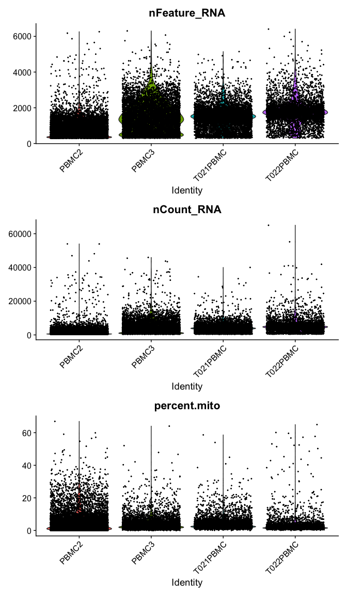
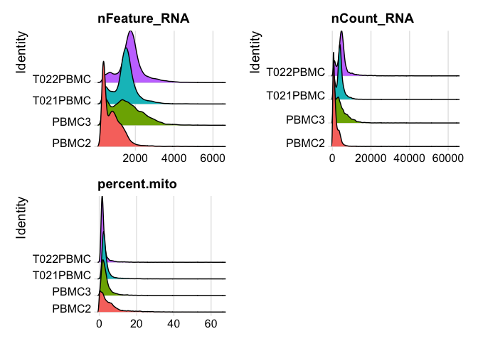
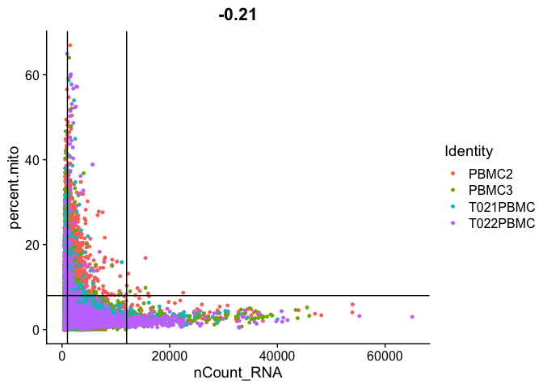
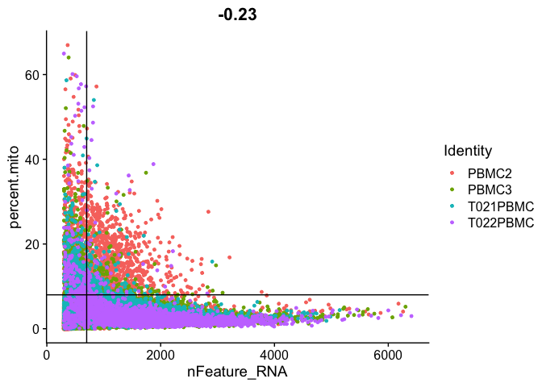
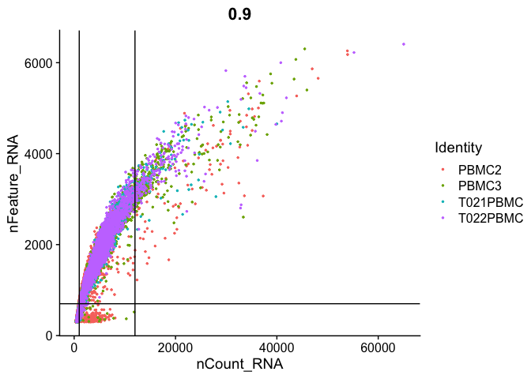
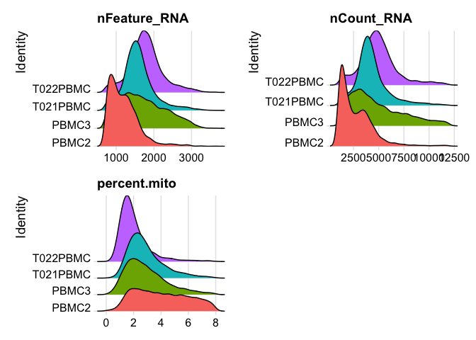
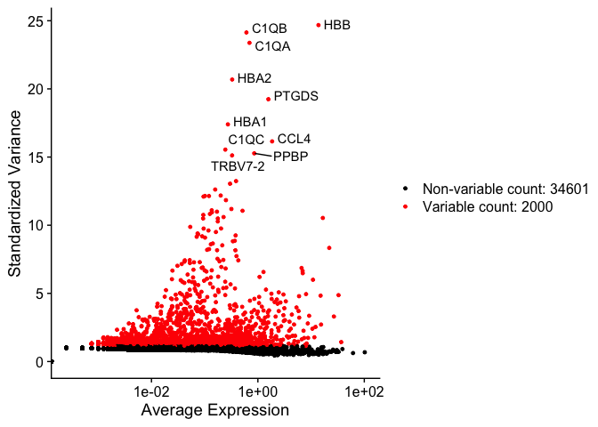

Last Updated: March 23 2021, 5pm

# Part 2: Some QA/QC, filtering and normalization

## Load libraries

```r
library(Seurat)
library(biomaRt)
library(ggplot2)
library(knitr)
library(kableExtra)
```

## Load the Seurat object from part 1

```r
load(file="original_seurat_object.RData")
experiment.aggregate
set.seed(12345)
```

<div class='r_output'> An object of class Seurat 
 36601 features across 29696 samples within 1 assay 
 Active assay: RNA (36601 features, 0 variable features)
</div>
```r
set.seed(12345)
```

## Some basic QA/QC of the metadata, print tables of the 5% quantiles.

Show 5% quantiles for number of genes per cell per sample

```r
kable(do.call("cbind", tapply(experiment.aggregate$nFeature_RNA, 
                      Idents(experiment.aggregate),quantile,probs=seq(0,1,0.05))),
      caption = "5% Quantiles of Genes/Cell by Sample") %>% kable_styling()
```

<table class="table" style="margin-left: auto; margin-right: auto;">
<caption>5% Quantiles of Genes/Cell by Sample</caption>
 <thead>
  <tr>
   <th style="text-align:left;">   </th>
   <th style="text-align:right;"> PBMC2 </th>
   <th style="text-align:right;"> PBMC3 </th>
   <th style="text-align:right;"> T021PBMC </th>
   <th style="text-align:right;"> T022PBMC </th>
  </tr>
 </thead>
<tbody>
  <tr>
   <td style="text-align:left;"> 0% </td>
   <td style="text-align:right;"> 300.0 </td>
   <td style="text-align:right;"> 300.00 </td>
   <td style="text-align:right;"> 300.0 </td>
   <td style="text-align:right;"> 300.00 </td>
  </tr>
  <tr>
   <td style="text-align:left;"> 5% </td>
   <td style="text-align:right;"> 311.0 </td>
   <td style="text-align:right;"> 364.00 </td>
   <td style="text-align:right;"> 445.0 </td>
   <td style="text-align:right;"> 618.35 </td>
  </tr>
  <tr>
   <td style="text-align:left;"> 10% </td>
   <td style="text-align:right;"> 321.0 </td>
   <td style="text-align:right;"> 459.30 </td>
   <td style="text-align:right;"> 598.0 </td>
   <td style="text-align:right;"> 884.40 </td>
  </tr>
  <tr>
   <td style="text-align:left;"> 15% </td>
   <td style="text-align:right;"> 334.0 </td>
   <td style="text-align:right;"> 563.00 </td>
   <td style="text-align:right;"> 808.0 </td>
   <td style="text-align:right;"> 1181.20 </td>
  </tr>
  <tr>
   <td style="text-align:left;"> 20% </td>
   <td style="text-align:right;"> 347.0 </td>
   <td style="text-align:right;"> 678.60 </td>
   <td style="text-align:right;"> 1030.0 </td>
   <td style="text-align:right;"> 1356.40 </td>
  </tr>
  <tr>
   <td style="text-align:left;"> 25% </td>
   <td style="text-align:right;"> 365.0 </td>
   <td style="text-align:right;"> 825.00 </td>
   <td style="text-align:right;"> 1190.0 </td>
   <td style="text-align:right;"> 1452.00 </td>
  </tr>
  <tr>
   <td style="text-align:left;"> 30% </td>
   <td style="text-align:right;"> 393.0 </td>
   <td style="text-align:right;"> 969.90 </td>
   <td style="text-align:right;"> 1276.0 </td>
   <td style="text-align:right;"> 1527.00 </td>
  </tr>
  <tr>
   <td style="text-align:left;"> 35% </td>
   <td style="text-align:right;"> 439.0 </td>
   <td style="text-align:right;"> 1091.00 </td>
   <td style="text-align:right;"> 1334.0 </td>
   <td style="text-align:right;"> 1588.00 </td>
  </tr>
  <tr>
   <td style="text-align:left;"> 40% </td>
   <td style="text-align:right;"> 509.0 </td>
   <td style="text-align:right;"> 1207.00 </td>
   <td style="text-align:right;"> 1390.0 </td>
   <td style="text-align:right;"> 1646.00 </td>
  </tr>
  <tr>
   <td style="text-align:left;"> 45% </td>
   <td style="text-align:right;"> 613.0 </td>
   <td style="text-align:right;"> 1312.00 </td>
   <td style="text-align:right;"> 1438.0 </td>
   <td style="text-align:right;"> 1695.00 </td>
  </tr>
  <tr>
   <td style="text-align:left;"> 50% </td>
   <td style="text-align:right;"> 697.0 </td>
   <td style="text-align:right;"> 1412.00 </td>
   <td style="text-align:right;"> 1481.0 </td>
   <td style="text-align:right;"> 1741.00 </td>
  </tr>
  <tr>
   <td style="text-align:left;"> 55% </td>
   <td style="text-align:right;"> 772.0 </td>
   <td style="text-align:right;"> 1521.65 </td>
   <td style="text-align:right;"> 1528.0 </td>
   <td style="text-align:right;"> 1788.85 </td>
  </tr>
  <tr>
   <td style="text-align:left;"> 60% </td>
   <td style="text-align:right;"> 842.0 </td>
   <td style="text-align:right;"> 1629.80 </td>
   <td style="text-align:right;"> 1573.0 </td>
   <td style="text-align:right;"> 1843.00 </td>
  </tr>
  <tr>
   <td style="text-align:left;"> 65% </td>
   <td style="text-align:right;"> 920.0 </td>
   <td style="text-align:right;"> 1753.00 </td>
   <td style="text-align:right;"> 1620.0 </td>
   <td style="text-align:right;"> 1894.55 </td>
  </tr>
  <tr>
   <td style="text-align:left;"> 70% </td>
   <td style="text-align:right;"> 1000.0 </td>
   <td style="text-align:right;"> 1883.10 </td>
   <td style="text-align:right;"> 1668.3 </td>
   <td style="text-align:right;"> 1950.90 </td>
  </tr>
  <tr>
   <td style="text-align:left;"> 75% </td>
   <td style="text-align:right;"> 1100.0 </td>
   <td style="text-align:right;"> 2022.00 </td>
   <td style="text-align:right;"> 1726.0 </td>
   <td style="text-align:right;"> 2021.00 </td>
  </tr>
  <tr>
   <td style="text-align:left;"> 80% </td>
   <td style="text-align:right;"> 1211.0 </td>
   <td style="text-align:right;"> 2212.00 </td>
   <td style="text-align:right;"> 1802.0 </td>
   <td style="text-align:right;"> 2114.00 </td>
  </tr>
  <tr>
   <td style="text-align:left;"> 85% </td>
   <td style="text-align:right;"> 1327.0 </td>
   <td style="text-align:right;"> 2395.00 </td>
   <td style="text-align:right;"> 1905.0 </td>
   <td style="text-align:right;"> 2252.95 </td>
  </tr>
  <tr>
   <td style="text-align:left;"> 90% </td>
   <td style="text-align:right;"> 1473.0 </td>
   <td style="text-align:right;"> 2641.00 </td>
   <td style="text-align:right;"> 2075.1 </td>
   <td style="text-align:right;"> 2508.00 </td>
  </tr>
  <tr>
   <td style="text-align:left;"> 95% </td>
   <td style="text-align:right;"> 1717.7 </td>
   <td style="text-align:right;"> 2997.70 </td>
   <td style="text-align:right;"> 2451.0 </td>
   <td style="text-align:right;"> 3013.25 </td>
  </tr>
  <tr>
   <td style="text-align:left;"> 100% </td>
   <td style="text-align:right;"> 6260.0 </td>
   <td style="text-align:right;"> 6303.00 </td>
   <td style="text-align:right;"> 5145.0 </td>
   <td style="text-align:right;"> 6407.00 </td>
  </tr>
</tbody>
</table>

Show 5% quantiles for number of UMI per cell per sample

```r
kable(do.call("cbind", tapply(experiment.aggregate$nCount_RNA, 
                                      Idents(experiment.aggregate),quantile,probs=seq(0,1,0.05))),
      caption = "5% Quantiles of UMI/Cell by Sample") %>% kable_styling()
```

<table class="table" style="margin-left: auto; margin-right: auto;">
<caption>5% Quantiles of UMI/Cell by Sample</caption>
 <thead>
  <tr>
   <th style="text-align:left;">   </th>
   <th style="text-align:right;"> PBMC2 </th>
   <th style="text-align:right;"> PBMC3 </th>
   <th style="text-align:right;"> T021PBMC </th>
   <th style="text-align:right;"> T022PBMC </th>
  </tr>
 </thead>
<tbody>
  <tr>
   <td style="text-align:left;"> 0% </td>
   <td style="text-align:right;"> 364.00 </td>
   <td style="text-align:right;"> 387.00 </td>
   <td style="text-align:right;"> 408.00 </td>
   <td style="text-align:right;"> 415.00 </td>
  </tr>
  <tr>
   <td style="text-align:left;"> 5% </td>
   <td style="text-align:right;"> 431.00 </td>
   <td style="text-align:right;"> 616.15 </td>
   <td style="text-align:right;"> 700.00 </td>
   <td style="text-align:right;"> 1068.40 </td>
  </tr>
  <tr>
   <td style="text-align:left;"> 10% </td>
   <td style="text-align:right;"> 455.00 </td>
   <td style="text-align:right;"> 797.00 </td>
   <td style="text-align:right;"> 1020.00 </td>
   <td style="text-align:right;"> 1673.40 </td>
  </tr>
  <tr>
   <td style="text-align:left;"> 15% </td>
   <td style="text-align:right;"> 482.00 </td>
   <td style="text-align:right;"> 1008.00 </td>
   <td style="text-align:right;"> 1514.00 </td>
   <td style="text-align:right;"> 2617.15 </td>
  </tr>
  <tr>
   <td style="text-align:left;"> 20% </td>
   <td style="text-align:right;"> 513.00 </td>
   <td style="text-align:right;"> 1287.00 </td>
   <td style="text-align:right;"> 2235.00 </td>
   <td style="text-align:right;"> 3268.20 </td>
  </tr>
  <tr>
   <td style="text-align:left;"> 25% </td>
   <td style="text-align:right;"> 556.25 </td>
   <td style="text-align:right;"> 1640.25 </td>
   <td style="text-align:right;"> 2808.00 </td>
   <td style="text-align:right;"> 3648.75 </td>
  </tr>
  <tr>
   <td style="text-align:left;"> 30% </td>
   <td style="text-align:right;"> 630.00 </td>
   <td style="text-align:right;"> 2024.00 </td>
   <td style="text-align:right;"> 3135.00 </td>
   <td style="text-align:right;"> 3923.10 </td>
  </tr>
  <tr>
   <td style="text-align:left;"> 35% </td>
   <td style="text-align:right;"> 745.55 </td>
   <td style="text-align:right;"> 2389.05 </td>
   <td style="text-align:right;"> 3348.00 </td>
   <td style="text-align:right;"> 4157.45 </td>
  </tr>
  <tr>
   <td style="text-align:left;"> 40% </td>
   <td style="text-align:right;"> 894.00 </td>
   <td style="text-align:right;"> 2743.40 </td>
   <td style="text-align:right;"> 3520.00 </td>
   <td style="text-align:right;"> 4363.80 </td>
  </tr>
  <tr>
   <td style="text-align:left;"> 45% </td>
   <td style="text-align:right;"> 1035.00 </td>
   <td style="text-align:right;"> 3066.35 </td>
   <td style="text-align:right;"> 3682.05 </td>
   <td style="text-align:right;"> 4559.15 </td>
  </tr>
  <tr>
   <td style="text-align:left;"> 50% </td>
   <td style="text-align:right;"> 1156.00 </td>
   <td style="text-align:right;"> 3398.50 </td>
   <td style="text-align:right;"> 3830.00 </td>
   <td style="text-align:right;"> 4752.00 </td>
  </tr>
  <tr>
   <td style="text-align:left;"> 55% </td>
   <td style="text-align:right;"> 1286.00 </td>
   <td style="text-align:right;"> 3784.65 </td>
   <td style="text-align:right;"> 3973.00 </td>
   <td style="text-align:right;"> 4930.85 </td>
  </tr>
  <tr>
   <td style="text-align:left;"> 60% </td>
   <td style="text-align:right;"> 1451.00 </td>
   <td style="text-align:right;"> 4210.80 </td>
   <td style="text-align:right;"> 4125.40 </td>
   <td style="text-align:right;"> 5121.20 </td>
  </tr>
  <tr>
   <td style="text-align:left;"> 65% </td>
   <td style="text-align:right;"> 1659.00 </td>
   <td style="text-align:right;"> 4684.95 </td>
   <td style="text-align:right;"> 4293.85 </td>
   <td style="text-align:right;"> 5336.20 </td>
  </tr>
  <tr>
   <td style="text-align:left;"> 70% </td>
   <td style="text-align:right;"> 1936.10 </td>
   <td style="text-align:right;"> 5279.00 </td>
   <td style="text-align:right;"> 4483.00 </td>
   <td style="text-align:right;"> 5582.00 </td>
  </tr>
  <tr>
   <td style="text-align:left;"> 75% </td>
   <td style="text-align:right;"> 2315.75 </td>
   <td style="text-align:right;"> 5940.75 </td>
   <td style="text-align:right;"> 4696.50 </td>
   <td style="text-align:right;"> 5847.25 </td>
  </tr>
  <tr>
   <td style="text-align:left;"> 80% </td>
   <td style="text-align:right;"> 2810.00 </td>
   <td style="text-align:right;"> 6852.80 </td>
   <td style="text-align:right;"> 4989.00 </td>
   <td style="text-align:right;"> 6211.20 </td>
  </tr>
  <tr>
   <td style="text-align:left;"> 85% </td>
   <td style="text-align:right;"> 3373.15 </td>
   <td style="text-align:right;"> 7873.65 </td>
   <td style="text-align:right;"> 5468.30 </td>
   <td style="text-align:right;"> 6772.75 </td>
  </tr>
  <tr>
   <td style="text-align:left;"> 90% </td>
   <td style="text-align:right;"> 3905.40 </td>
   <td style="text-align:right;"> 9212.70 </td>
   <td style="text-align:right;"> 6174.10 </td>
   <td style="text-align:right;"> 7907.60 </td>
  </tr>
  <tr>
   <td style="text-align:left;"> 95% </td>
   <td style="text-align:right;"> 4857.35 </td>
   <td style="text-align:right;"> 11522.20 </td>
   <td style="text-align:right;"> 7717.55 </td>
   <td style="text-align:right;"> 10940.50 </td>
  </tr>
  <tr>
   <td style="text-align:left;"> 100% </td>
   <td style="text-align:right;"> 53960.00 </td>
   <td style="text-align:right;"> 45925.00 </td>
   <td style="text-align:right;"> 40004.00 </td>
   <td style="text-align:right;"> 65032.00 </td>
  </tr>
</tbody>
</table>

Show 5% quantiles for number of mitochondrial percentage per cell per sample

```r
kable(round(do.call("cbind", tapply(experiment.aggregate$percent.mito, Idents(experiment.aggregate),quantile,probs=seq(0,1,0.05))), digits = 3),
      caption = "5% Quantiles of Percent Mitochondria by Sample") %>% kable_styling()
```

<table class="table" style="margin-left: auto; margin-right: auto;">
<caption>5% Quantiles of Percent Mitochondria by Sample</caption>
 <thead>
  <tr>
   <th style="text-align:left;">   </th>
   <th style="text-align:right;"> PBMC2 </th>
   <th style="text-align:right;"> PBMC3 </th>
   <th style="text-align:right;"> T021PBMC </th>
   <th style="text-align:right;"> T022PBMC </th>
  </tr>
 </thead>
<tbody>
  <tr>
   <td style="text-align:left;"> 0% </td>
   <td style="text-align:right;"> 0.000 </td>
   <td style="text-align:right;"> 0.000 </td>
   <td style="text-align:right;"> 0.000 </td>
   <td style="text-align:right;"> 0.000 </td>
  </tr>
  <tr>
   <td style="text-align:left;"> 5% </td>
   <td style="text-align:right;"> 0.170 </td>
   <td style="text-align:right;"> 0.901 </td>
   <td style="text-align:right;"> 1.297 </td>
   <td style="text-align:right;"> 0.857 </td>
  </tr>
  <tr>
   <td style="text-align:left;"> 10% </td>
   <td style="text-align:right;"> 0.433 </td>
   <td style="text-align:right;"> 1.193 </td>
   <td style="text-align:right;"> 1.544 </td>
   <td style="text-align:right;"> 1.025 </td>
  </tr>
  <tr>
   <td style="text-align:left;"> 15% </td>
   <td style="text-align:right;"> 0.760 </td>
   <td style="text-align:right;"> 1.450 </td>
   <td style="text-align:right;"> 1.736 </td>
   <td style="text-align:right;"> 1.137 </td>
  </tr>
  <tr>
   <td style="text-align:left;"> 20% </td>
   <td style="text-align:right;"> 1.107 </td>
   <td style="text-align:right;"> 1.627 </td>
   <td style="text-align:right;"> 1.894 </td>
   <td style="text-align:right;"> 1.247 </td>
  </tr>
  <tr>
   <td style="text-align:left;"> 25% </td>
   <td style="text-align:right;"> 1.452 </td>
   <td style="text-align:right;"> 1.811 </td>
   <td style="text-align:right;"> 2.033 </td>
   <td style="text-align:right;"> 1.341 </td>
  </tr>
  <tr>
   <td style="text-align:left;"> 30% </td>
   <td style="text-align:right;"> 1.795 </td>
   <td style="text-align:right;"> 1.996 </td>
   <td style="text-align:right;"> 2.183 </td>
   <td style="text-align:right;"> 1.431 </td>
  </tr>
  <tr>
   <td style="text-align:left;"> 35% </td>
   <td style="text-align:right;"> 2.144 </td>
   <td style="text-align:right;"> 2.187 </td>
   <td style="text-align:right;"> 2.317 </td>
   <td style="text-align:right;"> 1.523 </td>
  </tr>
  <tr>
   <td style="text-align:left;"> 40% </td>
   <td style="text-align:right;"> 2.560 </td>
   <td style="text-align:right;"> 2.376 </td>
   <td style="text-align:right;"> 2.450 </td>
   <td style="text-align:right;"> 1.609 </td>
  </tr>
  <tr>
   <td style="text-align:left;"> 45% </td>
   <td style="text-align:right;"> 3.045 </td>
   <td style="text-align:right;"> 2.577 </td>
   <td style="text-align:right;"> 2.583 </td>
   <td style="text-align:right;"> 1.700 </td>
  </tr>
  <tr>
   <td style="text-align:left;"> 50% </td>
   <td style="text-align:right;"> 3.598 </td>
   <td style="text-align:right;"> 2.795 </td>
   <td style="text-align:right;"> 2.731 </td>
   <td style="text-align:right;"> 1.798 </td>
  </tr>
  <tr>
   <td style="text-align:left;"> 55% </td>
   <td style="text-align:right;"> 4.193 </td>
   <td style="text-align:right;"> 3.010 </td>
   <td style="text-align:right;"> 2.893 </td>
   <td style="text-align:right;"> 1.902 </td>
  </tr>
  <tr>
   <td style="text-align:left;"> 60% </td>
   <td style="text-align:right;"> 4.878 </td>
   <td style="text-align:right;"> 3.268 </td>
   <td style="text-align:right;"> 3.060 </td>
   <td style="text-align:right;"> 2.028 </td>
  </tr>
  <tr>
   <td style="text-align:left;"> 65% </td>
   <td style="text-align:right;"> 5.556 </td>
   <td style="text-align:right;"> 3.548 </td>
   <td style="text-align:right;"> 3.261 </td>
   <td style="text-align:right;"> 2.167 </td>
  </tr>
  <tr>
   <td style="text-align:left;"> 70% </td>
   <td style="text-align:right;"> 6.326 </td>
   <td style="text-align:right;"> 3.865 </td>
   <td style="text-align:right;"> 3.505 </td>
   <td style="text-align:right;"> 2.337 </td>
  </tr>
  <tr>
   <td style="text-align:left;"> 75% </td>
   <td style="text-align:right;"> 7.135 </td>
   <td style="text-align:right;"> 4.287 </td>
   <td style="text-align:right;"> 3.810 </td>
   <td style="text-align:right;"> 2.560 </td>
  </tr>
  <tr>
   <td style="text-align:left;"> 80% </td>
   <td style="text-align:right;"> 8.255 </td>
   <td style="text-align:right;"> 4.831 </td>
   <td style="text-align:right;"> 4.220 </td>
   <td style="text-align:right;"> 2.841 </td>
  </tr>
  <tr>
   <td style="text-align:left;"> 85% </td>
   <td style="text-align:right;"> 9.867 </td>
   <td style="text-align:right;"> 5.667 </td>
   <td style="text-align:right;"> 4.785 </td>
   <td style="text-align:right;"> 3.369 </td>
  </tr>
  <tr>
   <td style="text-align:left;"> 90% </td>
   <td style="text-align:right;"> 13.351 </td>
   <td style="text-align:right;"> 7.015 </td>
   <td style="text-align:right;"> 5.807 </td>
   <td style="text-align:right;"> 4.363 </td>
  </tr>
  <tr>
   <td style="text-align:left;"> 95% </td>
   <td style="text-align:right;"> 19.802 </td>
   <td style="text-align:right;"> 9.943 </td>
   <td style="text-align:right;"> 8.575 </td>
   <td style="text-align:right;"> 7.221 </td>
  </tr>
  <tr>
   <td style="text-align:left;"> 100% </td>
   <td style="text-align:right;"> 66.956 </td>
   <td style="text-align:right;"> 64.033 </td>
   <td style="text-align:right;"> 58.654 </td>
   <td style="text-align:right;"> 64.962 </td>
  </tr>
</tbody>
</table>

Violin plot of 1) number of genes, 2) number of UMI and 3) percent mitochondrial genes

```r
VlnPlot(
  experiment.aggregate,
  features = c("nFeature_RNA", "nCount_RNA","percent.mito"),
  ncol = 1, pt.size = 0.3)
```

<!-- -->

plot ridgeplots of the same data


```r
RidgePlot(experiment.aggregate, features=c("nFeature_RNA","nCount_RNA", "percent.mito"), ncol = 2)
```

<!-- -->

Plot the distribution of number of cells each gene is represented by

```r
plot(sort(Matrix::rowSums(GetAssayData(experiment.aggregate) >= 3)) , xlab="gene rank", ylab="number of cells", main="Cells per genes (reads/gene >= 3 )")
```

<!-- -->


Gene Plot, scatter plot of gene expression across cells, (colored by sample), drawing horizontal an verticale lines at proposed filtering cutoffs.


```r
FeatureScatter(experiment.aggregate, feature1 = "nCount_RNA", feature2 = "percent.mito") + geom_vline(xintercept = c(1000,12000)) + geom_hline(yintercept = 8)
```

<!-- -->

```r
FeatureScatter(experiment.aggregate, feature1 = "nFeature_RNA", feature2 = "percent.mito") + geom_vline(xintercept = 700) + geom_hline(yintercept = 8)
```

<!-- -->

```r
FeatureScatter(
  experiment.aggregate, "nCount_RNA", "nFeature_RNA",
  pt.size = 0.5)  + geom_vline(xintercept = c(1000,12000)) + geom_hline(yintercept = 700)
```

<!-- -->

### Cell filtering

We use the information above to filter out cells. Here we choose those that have percent mitochondrial genes max of 8%, unique UMI counts under 1,000 or greater than 12,000 and contain at least 700 features within them.


```r
table(experiment.aggregate$orig.ident)
```

<div class='r_output'> 
    PBMC2    PBMC3 T021PBMC T022PBMC 
     8994     7304     8310     5088
</div>
```r
experiment.aggregate <- subset(experiment.aggregate, percent.mito <= 8)

experiment.aggregate <- subset(experiment.aggregate, nCount_RNA >= 1000 & nCount_RNA <= 12000)

experiment.aggregate <- subset(experiment.aggregate, nFeature_RNA >= 700)

experiment.aggregate
```

<div class='r_output'> An object of class Seurat 
 36601 features across 19874 samples within 1 assay 
 Active assay: RNA (36601 features, 0 variable features)
</div>
```r
table(experiment.aggregate$orig.ident)
```

<div class='r_output'> 
    PBMC2    PBMC3 T021PBMC T022PBMC 
     3096     5293     7017     4468
</div>
Lets se the ridgeplots now after filtering

```r
RidgePlot(experiment.aggregate, features=c("nFeature_RNA","nCount_RNA", "percent.mito"), ncol = 2)
```

<!-- -->
### You may also want to filter out additional genes.

When creating the base Seurat object we did filter out some genes, recall _Keep all genes expressed in >= 10 cells_. After filtering cells and you may want to be more aggressive with the gene filter. Seurat doesn't supply such a function (that I can find), so below is a function that can do so, it filters genes requiring a min.value (log-normalized) in at least min.cells, here expression of 1 in at least 400 cells.


```r
experiment.aggregate
```

<div class='r_output'> An object of class Seurat 
 36601 features across 19874 samples within 1 assay 
 Active assay: RNA (36601 features, 0 variable features)
</div>
```r
FilterGenes <-
 function (object, min.value=1, min.cells = 0, genes = NULL) {
   genes.use <- rownames(object)
   if (!is.null(genes)) {
     genes.use <- intersect(genes.use, genes)
     object@data <- GetAssayData(object)[genes.use, ]
   } else if (min.cells > 0) {
     num.cells <- Matrix::rowSums(GetAssayData(object) > min.value)
     genes.use <- names(num.cells[which(num.cells >= min.cells)])
     object = object[genes.use, ]
   }
  object <- LogSeuratCommand(object = object)
  return(object)
}

experiment.aggregate.genes <- FilterGenes(object = experiment.aggregate, min.value = 1, min.cells = 400)
experiment.aggregate.genes
```

<div class='r_output'> An object of class Seurat 
 3390 features across 19874 samples within 1 assay 
 Active assay: RNA (3390 features, 0 variable features)
</div>
```r
rm(experiment.aggregate.genes)
```

## FOR THIS WORKSHOP ONLY: Lets reduce the dataset down to 1000 cells per sample for time

```r
table(Idents(experiment.aggregate))
```

<div class='r_output'> 
    PBMC2    PBMC3 T021PBMC T022PBMC 
     3096     5293     7017     4468
</div>
```r
experiment.aggregate <- experiment.aggregate[,unlist(sapply(split(seq_along(Cells(experiment.aggregate)), experiment.aggregate$orig.ident), sample, size=1000, simplify = F))]
table(Idents(experiment.aggregate))
```

<div class='r_output'> 
    PBMC2    PBMC3 T021PBMC T022PBMC 
     1000     1000     1000     1000
</div>
## Next we want to normalize the data

After filtering out cells from the dataset, the next step is to normalize the data. By default, we employ a global-scaling normalization method LogNormalize that normalizes the gene expression measurements for each cell by the total expression, multiplies this by a scale factor (10,000 by default), and then log-transforms the data.


```r
?NormalizeData
```


```r
experiment.aggregate <- NormalizeData(
  object = experiment.aggregate,
  normalization.method = "LogNormalize",
  scale.factor = 10000)
```

### Calculate Cell-Cycle with Seurat, the list of genes comes with Seurat (only for human)
[Dissecting the multicellular ecosystem of metastatic melanoma by single-cell RNA-seq](https://www.ncbi.nlm.nih.gov/pmc/articles/PMC4944528/)

First need to convert to mouse symbols, we'll use Biomart for that too.

```r
# Mouse Code
# convertHumanGeneList <- function(x){
#   require("biomaRt")
#   human = useEnsembl("ensembl", dataset = "hsapiens_gene_ensembl", mirror = "uswest")
#   mouse = useEnsembl("ensembl", dataset = "mmusculus_gene_ensembl", mirror = "uswest")
# 
#   genes = getLDS(attributes = c("hgnc_symbol"), filters = "hgnc_symbol", values = x , mart = human, attributesL = c("mgi_symbol"), martL = mouse, uniqueRows=T)
# 
#   humanx <- unique(genes[, 2])
# 
#   # Print the first 6 genes found to the screen
#   print(head(humanx))
#   return(humanx)
# }
# 
# m.s.genes <- convertHumanGeneList(cc.genes.updated.2019$s.genes)
# m.g2m.genes <- convertHumanGeneList(cc.genes.updated.2019$g2m.genes)
# 
# # Create our Seurat object and complete the initialization steps
# experiment.aggregate <- CellCycleScoring(experiment.aggregate, s.features = m.s.genes, g2m.features = m.g2m.genes, set.ident = TRUE)

# Human Code
s.genes <- (cc.genes$s.genes)
g2m.genes <- (cc.genes$g2m.genes)

# Create our Seurat object and complete the initialization steps
experiment.aggregate <- CellCycleScoring(experiment.aggregate, s.features = s.genes, g2m.features = g2m.genes, set.ident = TRUE)
```

#### Table of cell cycle (seurate)


```r
table(experiment.aggregate@meta.data$Phase) %>% kable(caption = "Number of Cells in each Cell Cycle Stage", col.names = c("Stage", "Count"), align = "c") %>% kable_styling()
```

<table class="table" style="margin-left: auto; margin-right: auto;">
<caption>Number of Cells in each Cell Cycle Stage</caption>
 <thead>
  <tr>
   <th style="text-align:center;"> Stage </th>
   <th style="text-align:center;"> Count </th>
  </tr>
 </thead>
<tbody>
  <tr>
   <td style="text-align:center;"> G1 </td>
   <td style="text-align:center;"> 1676 </td>
  </tr>
  <tr>
   <td style="text-align:center;"> G2M </td>
   <td style="text-align:center;"> 898 </td>
  </tr>
  <tr>
   <td style="text-align:center;"> S </td>
   <td style="text-align:center;"> 1426 </td>
  </tr>
</tbody>
</table>

#### Fixing the defualt "Ident" in Seurat


```r
table(Idents(experiment.aggregate))
```

<div class='r_output'> 
  G2M    S   G1 
  898 1426 1676
</div>
```r
## So lets change it back to samplename
Idents(experiment.aggregate) <- "orig.ident"
table(Idents(experiment.aggregate))
```

<div class='r_output'> 
    PBMC2    PBMC3 T021PBMC T022PBMC 
     1000     1000     1000     1000
</div>

## Identify variable genes

The function FindVariableFeatures identifies the most highly variable genes (default 2000 genes) by fitting a line to the relationship of log(variance) and log(mean) using loess smoothing, uses this information to standardize the data, then calculates the variance of the standardized data.  This helps avoid selecting genes that only appear variable due to their expression level.


```r
?FindVariableFeatures
```


```r
experiment.aggregate <- FindVariableFeatures(
  object = experiment.aggregate,
  selection.method = "vst")

length(VariableFeatures(experiment.aggregate))
```

<div class='r_output'> [1] 2000
</div>
```r
top10 <- head(VariableFeatures(experiment.aggregate), 10)

top10
```

<div class='r_output'>  [1] "HBB"     "C1QB"    "C1QA"    "HBA2"    "PTGDS"   "HBA1"    "CCL4"   
  [8] "C1QC"    "PPBP"    "TRBV7-2"
</div>
```r
vfp1 <- VariableFeaturePlot(experiment.aggregate)
vfp1 <- LabelPoints(plot = vfp1, points = top10, repel = TRUE)
vfp1
```

<!-- -->

#### Question(s)

1. Play some with the filtering parameters, see how results change?
2. How do the results change if you use selection.method = "dispersion" or selection.method = "mean.var.plot"


## Finally, lets save the filtered and normalized data

```r
save(experiment.aggregate, file="pre_sample_corrected.RData")
```

## Get the next Rmd file

```r
download.file("https://raw.githubusercontent.com/ucdavis-bioinformatics-training/2021-March-Single-Cell-RNA-Seq-Analysis/master/data_analysis/scRNA_Workshop-PART3.Rmd", "scRNA_Workshop-PART3.Rmd")
```

## Session Information

```r
sessionInfo()
```

<div class='r_output'> R version 4.0.3 (2020-10-10)
 Platform: x86_64-apple-darwin17.0 (64-bit)
 Running under: macOS Big Sur 10.16
 
 Matrix products: default
 BLAS:   /Library/Frameworks/R.framework/Versions/4.0/Resources/lib/libRblas.dylib
 LAPACK: /Library/Frameworks/R.framework/Versions/4.0/Resources/lib/libRlapack.dylib
 
 locale:
 [1] en_US.UTF-8/en_US.UTF-8/en_US.UTF-8/C/en_US.UTF-8/en_US.UTF-8
 
 attached base packages:
 [1] stats     graphics  grDevices utils     datasets  methods   base     
 
 other attached packages:
 [1] kableExtra_1.3.4   knitr_1.31         ggplot2_3.3.3      biomaRt_2.44.4    
 [5] SeuratObject_4.0.0 Seurat_4.0.1      
 
 loaded via a namespace (and not attached):
   [1] systemfonts_1.0.1     BiocFileCache_1.12.1  plyr_1.8.6           
   [4] igraph_1.2.6          lazyeval_0.2.2        splines_4.0.3        
   [7] listenv_0.8.0         scattermore_0.7       digest_0.6.27        
  [10] htmltools_0.5.1.1     fansi_0.4.2           magrittr_2.0.1       
  [13] memoise_2.0.0         tensor_1.5            cluster_2.1.1        
  [16] ROCR_1.0-11           globals_0.14.0        matrixStats_0.58.0   
  [19] svglite_2.0.0         askpass_1.1           spatstat.sparse_2.0-0
  [22] prettyunits_1.1.1     colorspace_2.0-0      rvest_1.0.0          
  [25] blob_1.2.1            rappdirs_0.3.3        ggrepel_0.9.1        
  [28] xfun_0.22             dplyr_1.0.5           crayon_1.4.1         
  [31] jsonlite_1.7.2        spatstat.data_2.1-0   survival_3.2-10      
  [34] zoo_1.8-9             glue_1.4.2            polyclip_1.10-0      
  [37] gtable_0.3.0          webshot_0.5.2         leiden_0.3.7         
  [40] future.apply_1.7.0    BiocGenerics_0.34.0   abind_1.4-5          
  [43] scales_1.1.1          DBI_1.1.1             miniUI_0.1.1.1       
  [46] Rcpp_1.0.6            viridisLite_0.3.0     xtable_1.8-4         
  [49] progress_1.2.2        reticulate_1.18       spatstat.core_1.65-5 
  [52] bit_4.0.4             stats4_4.0.3          htmlwidgets_1.5.3    
  [55] httr_1.4.2            RColorBrewer_1.1-2    ellipsis_0.3.1       
  [58] ica_1.0-2             farver_2.1.0          pkgconfig_2.0.3      
  [61] XML_3.99-0.6          sass_0.3.1            uwot_0.1.10          
  [64] dbplyr_2.1.0          deldir_0.2-10         utf8_1.2.1           
  [67] labeling_0.4.2        tidyselect_1.1.0      rlang_0.4.10         
  [70] reshape2_1.4.4        later_1.1.0.1         AnnotationDbi_1.50.3 
  [73] munsell_0.5.0         tools_4.0.3           cachem_1.0.4         
  [76] generics_0.1.0        RSQLite_2.2.4         ggridges_0.5.3       
  [79] evaluate_0.14         stringr_1.4.0         fastmap_1.1.0        
  [82] yaml_2.2.1            goftest_1.2-2         bit64_4.0.5          
  [85] fitdistrplus_1.1-3    purrr_0.3.4           RANN_2.6.1           
  [88] pbapply_1.4-3         future_1.21.0         nlme_3.1-152         
  [91] mime_0.10             xml2_1.3.2            compiler_4.0.3       
  [94] rstudioapi_0.13       plotly_4.9.3          curl_4.3             
  [97] png_0.1-7             spatstat.utils_2.1-0  tibble_3.1.0         
 [100] bslib_0.2.4           stringi_1.5.3         highr_0.8            
 [103] lattice_0.20-41       Matrix_1.3-2          vctrs_0.3.6          
 [106] pillar_1.5.1          lifecycle_1.0.0       spatstat.geom_2.0-1  
 [109] lmtest_0.9-38         jquerylib_0.1.3       RcppAnnoy_0.0.18     
 [112] data.table_1.14.0     cowplot_1.1.1         irlba_2.3.3          
 [115] httpuv_1.5.5          patchwork_1.1.1       R6_2.5.0             
 [118] promises_1.2.0.1      KernSmooth_2.23-18    gridExtra_2.3        
 [121] IRanges_2.22.2        parallelly_1.24.0     codetools_0.2-18     
 [124] MASS_7.3-53.1         assertthat_0.2.1      openssl_1.4.3        
 [127] withr_2.4.1           sctransform_0.3.2     S4Vectors_0.26.1     
 [130] mgcv_1.8-34           parallel_4.0.3        hms_1.0.0            
 [133] grid_4.0.3            rpart_4.1-15          tidyr_1.1.3          
 [136] rmarkdown_2.7         Rtsne_0.15            Biobase_2.48.0       
 [139] shiny_1.6.0
</div>