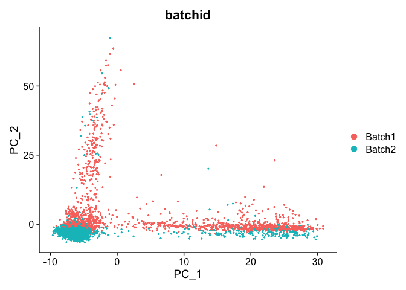
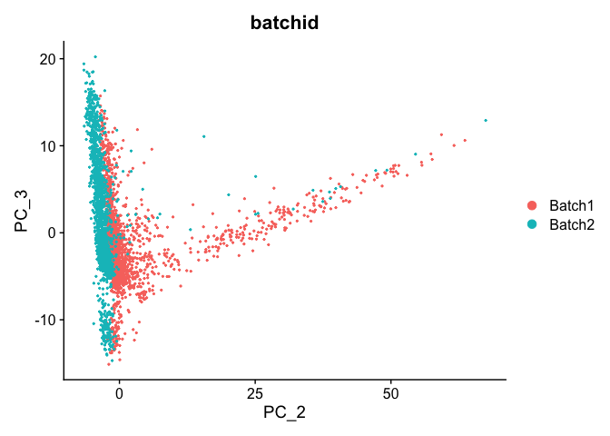
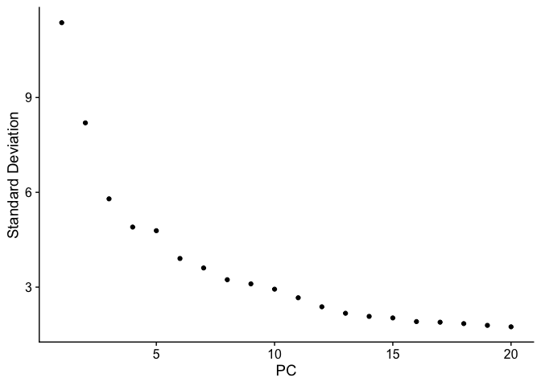
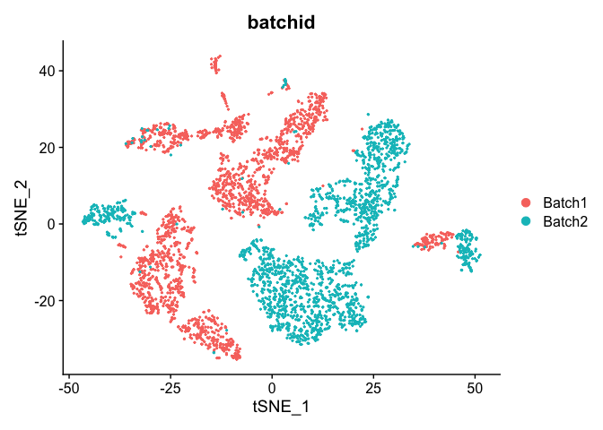
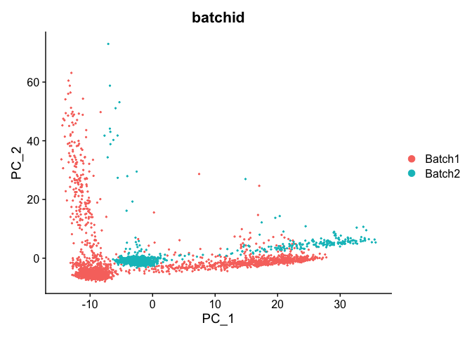
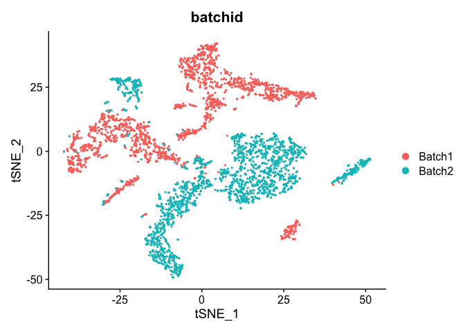

## Load libraries

```r
library(Seurat)
```

## Load the Seurat object

```r
load(file="pre_sample_corrected.RData")
experiment.aggregate
```

<div class='r_output'> An object of class Seurat 
 36601 features across 4000 samples within 1 assay 
 Active assay: RNA (36601 features, 2000 variable features)
</div>
```r
experiment.test <- experiment.aggregate
set.seed(12345)
rand.genes <- sample(1:nrow(experiment.test), 500,replace = F)
mat <- as.matrix(GetAssayData(experiment.test, slot="data"))
mat[rand.genes,experiment.test$batchid=="Batch2"] <- mat[rand.genes,experiment.test$batchid=="Batch2"] + 0.22
experiment.test = SetAssayData(experiment.test, slot="data", new.data= mat )
rm(mat)
```

## Exploring Batch effects, none, Seurat [vars.to.regress]

First lets view the data without any corrections

## PCA in prep for tSNE

ScaleData - Scales and centers genes in the dataset.

```r
?ScaleData
experiment.test.noc <- ScaleData(object = experiment.test)
```

<div class='r_output'> Centering and scaling data matrix
</div>
### Run PCA

```r
experiment.test.noc <- RunPCA(object = experiment.test.noc)
```

<div class='r_output'> PC_ 1 
 Positive:  IFI30, SERPINA1, FCN1, SPI1, AIF1, CST3, APOBEC3A, IFITM3, LST1, CFD 
 	   MAFB, TYMP, LYZ, GRN, LILRB2, IFI27, S100A11, SLC11A1, S100A9, FTL 
 	   MS4A6A, CFP, TYROBP, PYCARD, FPR1, MNDA, S100A8, CEBPD, LILRA5, NCF2 
 Negative:  CD69, IL32, CXCR4, IL7R, LTB, JUN, CD247, CD7, CTSW, GZMM 
 	   GZMA, BX539320.1, TRH, PIM2, IGKV3OR2-268, TCF7, AC005962.2, BTNL9, GNLY, CD5 
 	   CCL5, HSPA5, CST7, LEF1, CCR7, AL031590.1, MAL, TNFAIP3, PRKCQ-AS1, PRF1 
 PC_ 2 
 Positive:  GP9, TUBB1, TMEM40, CAVIN2, GNG11, PPBP, MPIG6B, CMTM5, PF4, ESAM 
 	   SPARC, TSC22D1, GP1BB, RGS18, HIST1H2AC, NRGN, PTGS1, HIST1H3H, TRIM58, ACRBP 
 	   AP003068.2, TREML1, HIST1H2BJ, C2orf88, TPM1, CLEC1B, TUBA8, F13A1, MPP1, LY6G6F 
 Negative:  DUSP1, JUNB, NFKBIA, ZFP36, FOS, TNFAIP3, BX539320.1, KLF6, IER2, JUN 
 	   CXCR4, HSP90AA1, TRH, AC005962.2, HSPA5, IGKV3OR2-268, BTNL9, VIM, GADD45B, CD69 
 	   NR4A2, DDIT4, ISG15, CALR, FOSB, CCR5, IFITM2, PPIB, CRIP1, S100A6 
 PC_ 3 
 Positive:  PRF1, GZMB, CST7, NKG7, GNLY, FGFBP2, SPON2, CTSW, GZMA, KLRD1 
 	   ADGRG1, FCGR3A, KLRF1, GZMH, CCL5, CCL4, S1PR5, GZMM, MYOM2, IL2RB 
 	   CD247, PRSS23, HOPX, SRGN, KLRK1, IGFBP7, CLIC3, TTC38, SH2D1B, FCRL6 
 Negative:  LTB, CD79A, MS4A1, LINC00926, IGHM, NIBAN3, AFF3, CCR7, FCER2, RALGPS2 
 	   HLA-DQB1, TCL1A, CD19, IGHD, BACH2, HLA-DRA, FCRL1, VPREB3, FCRLA, TNFRSF13C 
 	   RUBCNL, BLK, MEF2C, COL19A1, CD22, HLA-DOB, BANK1, PAX5, ADAM28, IL7R 
 PC_ 4 
 Positive:  IL7R, SOCS3, TCF7, RGCC, MAL, FOSB, SLC2A3, TNFAIP3, FOS, LEF1 
 	   CD5, JUNB, VIM, BX539320.1, TOB1, PRKCQ-AS1, ICOS, AC005962.2, TRH, GPR183 
 	   PLK3, AQP3, TRAT1, PTGER4, CD28, NELL2, IGKV3OR2-268, AL031590.1, LTB, LMNA 
 Negative:  CD79A, MS4A1, LINC00926, HLA-DQA1, NIBAN3, HLA-DQB1, IGHM, CD74, FCER2, HLA-DRA 
 	   HLA-DRB1, AFF3, CD19, TCL1A, HLA-DPA1, IGHD, CD79B, FCRLA, FCRL1, RALGPS2 
 	   VPREB3, HLA-DPB1, ADAM28, BLK, MEF2C, HLA-DOB, PAX5, RUBCNL, CD22, BANK1 
 PC_ 5 
 Positive:  BX539320.1, TRH, BTNL9, CD83, AC005962.2, IGKV3OR2-268, FOSB, AL031590.1, FOS, DUSP1 
 	   IL1B, CD24, HIC1, BANK1, CCR5, STAG3, JUNB, MDK, JUN, CD79A 
 	   MS4A1, NR4A1, ZFP36, HLA-DQA1, CXCR4, G0S2, NR4A2, NFKBIA, ID3, FCER2 
 Negative:  HBB, HBA2, ALAS2, HBA1, S100A8, CEBPD, HBD, RPS4Y1, AHSP, HBM 
 	   S100A9, HIST1H1E, SLC25A37, SELENBP1, LYZ, CA1, HIST1H1D, IGKV4-1, DCAF12, VCAN 
 	   IL1R2, SLC4A1, PLBD1, NKG7, IGLV1-40, FKBP5, MEGF9, EPB42, CD163, CLU
</div>
```r
DimPlot(object = experiment.test.noc, group.by = "batchid", reduction = "pca")
```



```r
DimPlot(object = experiment.test.noc, group.by = "batchid", dims = c(2,3), reduction = "pca")
```



PCA Elbow plot to determine how many principal components to use in downstream analyses.  Components after the "elbow" in the plot generally explain little additional variability in the data.


```r
ElbowPlot(experiment.test.noc)
```

<!-- -->

We use 10 components in downstream analyses. Using more components more closely approximates the full data set but increases run time.

### TSNE Plot

```r
pcs.use <- 10
experiment.test.noc <- RunTSNE(object = experiment.test.noc, dims = 1:pcs.use)
DimPlot(object = experiment.test.noc,  group.by = "batchid")
```



## Correct for sample to sample differences (seurat)

Use vars.to.regress to correct for the sample to sample differences and percent mitochondria

```r
experiment.test.regress <- ScaleData(object = experiment.test,
                    vars.to.regress = c("batchid"), model.use = "linear")
```

<div class='r_output'> Regressing out batchid
</div>
<div class='r_output'> Centering and scaling data matrix
</div>
```r
experiment.test.regress <- RunPCA(object =experiment.test.regress)
```

<div class='r_output'> PC_ 1 
 Positive:  IFI30, SERPINA1, FCN1, SPI1, AIF1, APOBEC3A, LST1, CST3, IFITM3, CFD 
 	   TYMP, MAFB, GRN, S100A11, LYZ, LILRB2, TYROBP, SLC11A1, CFP, PYCARD 
 	   MS4A6A, FPR1, S100A9, MNDA, IFI27, NCF2, FTL, LILRA5, CTSS, BRI3 
 Negative:  IL32, CD69, IL7R, LTB, CCL5, CD7, CXCR4, CTSW, CD247, GZMM 
 	   TCF7, GZMA, GNLY, LEF1, GRAP2, PRKCQ-AS1, TUBB1, MPIG6B, CST7, JUN 
 	   PIM2, CCR7, HIST1H1D, CD5, ITM2A, GP9, MAL, IGKV4-1, PPBP, PRF1 
 PC_ 2 
 Positive:  GP9, TUBB1, TMEM40, ESAM, GNG11, CAVIN2, CMTM5, TSC22D1, RGS18, PF4 
 	   MPIG6B, PPBP, SPARC, GP1BB, HIST1H2AC, HIST1H3H, PTGS1, NRGN, ACRBP, TRIM58 
 	   AP003068.2, C2orf88, HIST1H2BJ, YWHAH, CLEC1B, MPP1, TUBA8, TREML1, LIMS1, LY6G6F 
 Negative:  HSPA5, JUNB, CXCR4, CD69, HSP90AA1, IL32, TNFAIP3, CD7, PPIB, CALR 
 	   CD247, HSP90B1, GZMA, PRF1, VIM, ZFP36, NKG7, JUN, NFKBIA, GZMM 
 	   DUSP1, CTSW, KLF6, GNLY, CD74, GZMB, KLRD1, AHNAK, LTB, IL7R 
 PC_ 3 
 Positive:  PRF1, GZMB, NKG7, CST7, GNLY, FGFBP2, CTSW, SPON2, GZMA, KLRD1 
 	   ADGRG1, GZMH, KLRF1, FCGR3A, CCL5, S1PR5, GZMM, IL2RB, CCL4, HOPX 
 	   CD247, MYOM2, PRSS23, KLRK1, CLIC3, IGFBP7, FCRL6, TTC38, SH2D1B, MATK 
 Negative:  LTB, CD79A, MS4A1, CCR7, LINC00926, IGHM, FCER2, NIBAN3, AFF3, BACH2 
 	   BANK1, RALGPS2, IL7R, TCL1A, CD19, HLA-DRA, VPREB3, HLA-DQB1, IGHD, FCRL1 
 	   FCRLA, MAL, TCF7, PIM2, LEF1, RUBCNL, BLK, TNFRSF13C, CD22, MEF2C 
 PC_ 4 
 Positive:  IL7R, TCF7, MAL, LEF1, SOCS3, VIM, CD5, PRKCQ-AS1, TNFAIP3, IL32 
 	   SLC2A3, TRAT1, NELL2, ICOS, AQP3, CD28, TOB1, TSHZ2, RGCC, AP3M2 
 	   CD27, GPR183, ANXA1, ADTRP, S100A6, S100A10, PTGER4, SIRPG, CISH, PASK 
 Negative:  CD79A, MS4A1, HLA-DQA1, LINC00926, NIBAN3, IGHM, FCER2, HLA-DQB1, HLA-DRA, BANK1 
 	   AFF3, CD74, CD19, HLA-DRB1, FCRLA, VPREB3, TCL1A, IGHD, HLA-DPA1, CD79B 
 	   CD83, FCRL1, RALGPS2, HLA-DPB1, BLK, ADAM28, CD22, MEF2C, HLA-DOB, RUBCNL 
 PC_ 5 
 Positive:  C1QA, C1QB, GSTM1, CDKN1C, MS4A7, C1QC, LINC02432, MS4A4A, RNASET2, HLA-DRB5 
 	   SMIM25, HSPB1, FMNL2, CSF1R, RPS27L, CASP5, GPBAR1, ICAM2, METTL7B, KCNMA1 
 	   LTB, CALHM6, CNIH4, CHCHD10, DDIT4, H2AFZ, SIGLEC10, LRRC25, SCIMP, FPR2 
 Negative:  S100A8, IL1B, CXCL8, VCAN, S100A9, S100A12, AC020916.1, CCL3, IER3, ATF3 
 	   CD14, CCL3L1, LYZ, CES1, ATP2B1-AS1, KDM6B, HES1, CSF3R, LUCAT1, SLC25A37 
 	   EREG, PHACTR1, FOSB, PTPRE, EMP1, AC020656.1, HBB, TREM1, DMXL2, NEAT1
</div>
```r
DimPlot(object = experiment.test.regress, group.by = "batchid", reduction = "pca")
```



### Corrected TSNE Plot

```r
experiment.test.regress <- RunTSNE(object = experiment.test.regress, dims.use = 1:pcs.use)
DimPlot(object = experiment.test.regress, group.by = "batchid", reduction = "tsne")
```



#### Question(s)

1. Try a couple of PCA cutoffs (low and high) and compare the TSNE plots from the different methods.  Do they look meaningfully different?

## Get the next Rmd file

```r
download.file("https://raw.githubusercontent.com/ucdavis-bioinformatics-training/2021-March-Single-Cell-RNA-Seq-Analysis/master/data_analysis/scRNA_Workshop-PART4.Rmd", "scRNA_Workshop-PART4.Rmd")
```

## Session Information

```r
sessionInfo()
```

<div class='r_output'> R version 4.0.3 (2020-10-10)
 Platform: x86_64-apple-darwin17.0 (64-bit)
 Running under: macOS Big Sur 10.16
 
 Matrix products: default
 BLAS:   /Library/Frameworks/R.framework/Versions/4.0/Resources/lib/libRblas.dylib
 LAPACK: /Library/Frameworks/R.framework/Versions/4.0/Resources/lib/libRlapack.dylib
 
 locale:
 [1] en_US.UTF-8/en_US.UTF-8/en_US.UTF-8/C/en_US.UTF-8/en_US.UTF-8
 
 attached base packages:
 [1] stats     graphics  grDevices utils     datasets  methods   base     
 
 other attached packages:
 [1] SeuratObject_4.0.0 Seurat_4.0.1      
 
 loaded via a namespace (and not attached):
   [1] Rtsne_0.15            colorspace_2.0-0      deldir_0.2-10        
   [4] ellipsis_0.3.1        ggridges_0.5.3        spatstat.data_2.1-0  
   [7] leiden_0.3.7          listenv_0.8.0         farver_2.1.0         
  [10] ggrepel_0.9.1         fansi_0.4.2           codetools_0.2-18     
  [13] splines_4.0.3         knitr_1.31            polyclip_1.10-0      
  [16] jsonlite_1.7.2        ica_1.0-2             cluster_2.1.1        
  [19] png_0.1-7             uwot_0.1.10           shiny_1.6.0          
  [22] sctransform_0.3.2     spatstat.sparse_2.0-0 compiler_4.0.3       
  [25] httr_1.4.2            assertthat_0.2.1      Matrix_1.3-2         
  [28] fastmap_1.1.0         lazyeval_0.2.2        later_1.1.0.1        
  [31] htmltools_0.5.1.1     tools_4.0.3           igraph_1.2.6         
  [34] gtable_0.3.0          glue_1.4.2            RANN_2.6.1           
  [37] reshape2_1.4.4        dplyr_1.0.5           Rcpp_1.0.6           
  [40] scattermore_0.7       jquerylib_0.1.3       vctrs_0.3.6          
  [43] nlme_3.1-152          lmtest_0.9-38         xfun_0.22            
  [46] stringr_1.4.0         globals_0.14.0        mime_0.10            
  [49] miniUI_0.1.1.1        lifecycle_1.0.0       irlba_2.3.3          
  [52] goftest_1.2-2         future_1.21.0         MASS_7.3-53.1        
  [55] zoo_1.8-9             scales_1.1.1          spatstat.core_1.65-5 
  [58] promises_1.2.0.1      spatstat.utils_2.1-0  parallel_4.0.3       
  [61] RColorBrewer_1.1-2    yaml_2.2.1            reticulate_1.18      
  [64] pbapply_1.4-3         gridExtra_2.3         ggplot2_3.3.3        
  [67] sass_0.3.1            rpart_4.1-15          stringi_1.5.3        
  [70] highr_0.8             rlang_0.4.10          pkgconfig_2.0.3      
  [73] matrixStats_0.58.0    evaluate_0.14         lattice_0.20-41      
  [76] ROCR_1.0-11           purrr_0.3.4           tensor_1.5           
  [79] patchwork_1.1.1       htmlwidgets_1.5.3     labeling_0.4.2       
  [82] cowplot_1.1.1         tidyselect_1.1.0      parallelly_1.24.0    
  [85] RcppAnnoy_0.0.18      plyr_1.8.6            magrittr_2.0.1       
  [88] R6_2.5.0              generics_0.1.0        DBI_1.1.1            
  [91] pillar_1.5.1          mgcv_1.8-34           fitdistrplus_1.1-3   
  [94] survival_3.2-10       abind_1.4-5           tibble_3.1.0         
  [97] future.apply_1.7.0    crayon_1.4.1          KernSmooth_2.23-18   
 [100] utf8_1.2.1            spatstat.geom_2.0-1   plotly_4.9.3         
 [103] rmarkdown_2.7         grid_4.0.3            data.table_1.14.0    
 [106] digest_0.6.27         xtable_1.8-4          tidyr_1.1.3          
 [109] httpuv_1.5.5          munsell_0.5.0         viridisLite_0.3.0    
 [112] bslib_0.2.4
</div>