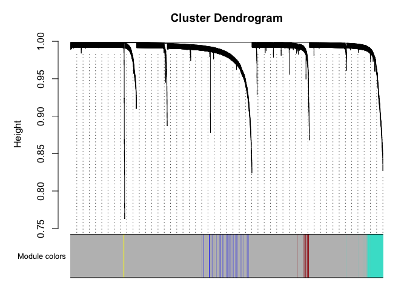
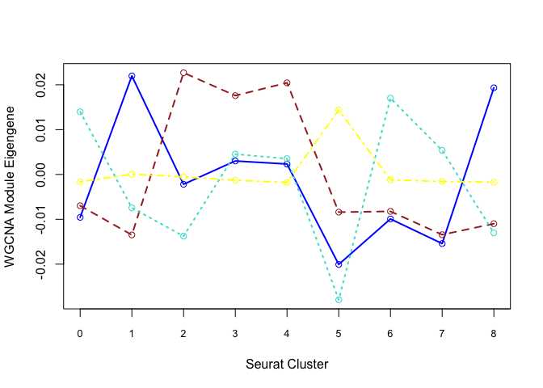
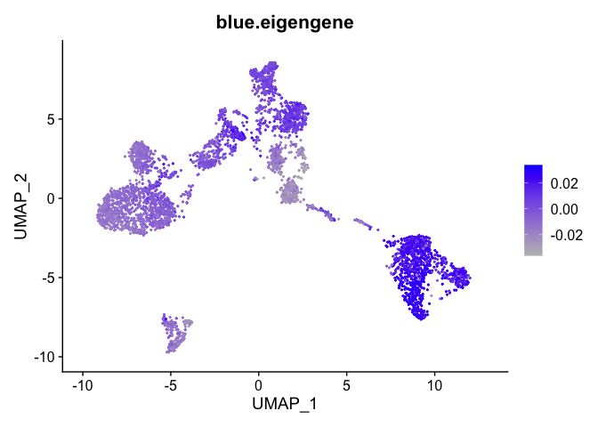

# Setup additinal options


## Load libraries

```r
library(Seurat)
library(ggplot2)
library(limma)
library(topGO)
library(WGCNA)
```

## Load the Seurat object

```r
load("clusters_seurat_object.RData")
experiment.merged
```

```
## An object of class Seurat 
## 36601 features across 4000 samples within 1 assay 
## Active assay: RNA (36601 features, 2000 variable features)
##  3 dimensional reductions calculated: pca, tsne, umap
```

```r
Idents(experiment.merged) <- "RNA_snn_res.0.25"
```


#1. DE With Single Cell Data Using Limma
For differential expression using models more complex than those allowed by FindMarkers() and FindAllMarkers(), data from Seurat may be used in limma (https://www.bioconductor.org/packages/devel/bioc/vignettes/limma/inst/doc/usersguide.pdf)

We illustrate by comparing sample 1 to sample 2 within cluster 0:

```r
cluster0 <- subset(experiment.merged, idents = '0')
expr <- as.matrix(GetAssayData(cluster0))

# Filter out genes that are 0 for every cell in this cluster
bad <- which(rowSums(expr) == 0)
expr <- expr[-bad,]

mm <- model.matrix(~0 + orig.ident, data = cluster0@meta.data)
fit <- lmFit(expr, mm)  
head(coef(fit)) # means in each sample for each gene
```

```
##            orig.identPBMC2 orig.identPBMC3 orig.identT021PBMC orig.identT022PBMC
## AL627309.5      0.00000000      0.09278631        0.005032979        0.014975512
## LINC01409       0.00000000      0.00000000        0.006526071        0.018558404
## LINC01128       0.08781332      0.00000000        0.052129308        0.095441205
## LINC00115       0.00000000      0.00000000        0.007809674        0.013766512
## NOC2L           0.07264820      0.16756185        0.307752834        0.227656257
## KLHL17          0.00000000      0.00000000        0.025409443        0.006485163
```

```r
contr <- makeContrasts(orig.identPBMC2 - orig.identPBMC3, levels = colnames(coef(fit)))
tmp <- contrasts.fit(fit, contrasts = contr)
tmp <- eBayes(tmp)
topTable(tmp, sort.by = "P", n = 20) # top 20 DE genes
```

```
##                logFC     AveExpr         t       P.Value     adj.P.Val         B
## RPS4Y1    -1.6532336 0.029174711 -38.37491 6.168119e-200 1.013607e-195 440.65923
## CEBPD     -1.1289309 0.037652250 -18.77288  9.638959e-68  7.919851e-64 142.62775
## SERPINA1  -1.1174456 0.042681254 -16.06871  5.999411e-52  3.286278e-48 106.87221
## LGALS2    -0.4961211 0.011020581 -15.82609  1.341377e-50  5.510713e-47 103.81744
## LILRA5    -0.5602333 0.014666118 -15.66319  1.063496e-49  3.495285e-46 101.78198
## TGFBI     -0.4262776 0.009827447 -15.39643  3.069136e-48  8.405851e-45  98.47652
## CLEC4E    -0.3079079 0.005433668 -15.22063  2.760467e-47  6.480394e-44  96.31723
## LILRB4    -0.3351893 0.008226769 -13.83378  5.236409e-40  1.075624e-36  79.84697
## GSTM1     -0.1853675 0.003271191 -13.73878  1.587677e-39  2.898921e-36  78.75711
## FCGR1A    -0.5509186 0.019832909 -13.70434  2.370812e-39  3.895956e-36  78.36316
## TFEC      -0.1805076 0.003185429 -13.65113  4.397924e-39  6.570099e-36  77.75607
## CD163     -0.4707119 0.011977161 -13.42900  5.700493e-38  7.806350e-35  75.23907
## UTY       -0.3960341 0.006988838 -13.19011  8.679830e-37  1.097197e-33  72.56418
## CD302     -0.3996428 0.011492329 -13.03015  5.273315e-36  6.189741e-33  70.79203
## IFI27     -1.9442354 0.139050432 -12.93048  1.610449e-35  1.764301e-32  69.69554
## RBP7      -0.3308949 0.005839322 -12.62239  4.885460e-34  5.017672e-31  66.34458
## SLC7A7    -0.3248241 0.008875956 -12.49177  2.039404e-33  1.971384e-30  64.94151
## LINC01637 -0.2645501 0.004668531 -12.16772  6.742679e-32  6.155692e-29  61.50714
## IGSF6     -0.4268268 0.014385703 -11.86693  1.632486e-30  1.411928e-27  58.37941
## IL1R2     -0.1930660 0.003407048 -11.57706  3.327906e-29  2.619763e-26  55.42127
```
* logFC: log2 fold change (UCD_Supp_VitE/UCD_Adj_VitE)
* AveExpr: Average expression, in log2 counts per million, across all cells included in analysis (i.e. those in cluster 0)
* t: t-statistic, i.e. logFC divided by its standard error
* P.Value: Raw p-value from test that logFC differs from 0
* adj.P.Val: Benjamini-Hochberg false discovery rate adjusted p-value

The limma vignette linked above gives more detail on model specification.

# 2. Gene Ontology (GO) Enrichment of Genes Expressed in a Cluster

```r
# install org.Hs.eg.db from Bioconductor if not already installed (for mouse only)
cluster0 <- subset(experiment.merged, idents = '0')
expr <- as.matrix(GetAssayData(cluster0))
# Filter out genes that are 0 for every cell in this cluster
bad <- which(rowSums(expr) == 0)
expr <- expr[-bad,]

# Select genes that are expressed > 0 in at least 75% of cells (somewhat arbitrary definition)
n.gt.0 <- apply(expr, 1, function(x)length(which(x > 0)))
expressed.genes <- rownames(expr)[which(n.gt.0/ncol(expr) >= 0.5)]
all.genes <- rownames(expr)

# define geneList as 1 if gene is in expressed.genes, 0 otherwise
geneList <- ifelse(all.genes %in% expressed.genes, 1, 0)
names(geneList) <- all.genes

# Create topGOdata object
	GOdata <- new("topGOdata",
		ontology = "BP", # use biological process ontology
		allGenes = geneList,
		geneSelectionFun = function(x)(x == 1),
              annot = annFUN.org, mapping = "org.Hs.eg.db", ID = "symbol")
# Test for enrichment using Fisher's Exact Test
	resultFisher <- runTest(GOdata, algorithm = "elim", statistic = "fisher")
	GenTable(GOdata, Fisher = resultFisher, topNodes = 20, numChar = 60)
```

```
##         GO.ID                                                            Term Annotated Significant Expected  Fisher
## 1  GO:0006614     SRP-dependent cotranslational protein targeting to membrane        95          80     5.28 < 1e-30
## 2  GO:0006413                                        translational initiation       184         101    10.24 < 1e-30
## 3  GO:0000184 nuclear-transcribed mRNA catabolic process, nonsense-mediate...       119          81     6.62 < 1e-30
## 4  GO:0019083                                             viral transcription       174          81     9.68 < 1e-30
## 5  GO:0002181                                         cytoplasmic translation        92          49     5.12 6.8e-29
## 6  GO:0035722                       interleukin-12-mediated signaling pathway        43          20     2.39 1.7e-14
## 7  GO:0060337                             type I interferon signaling pathway        74          24     4.12 6.4e-13
## 8  GO:0006123        mitochondrial electron transport, cytochrome c to oxygen        15          10     0.83 6.2e-10
## 9  GO:0016032                                                   viral process       744         167    41.39 1.4e-09
## 10 GO:0042776            mitochondrial ATP synthesis coupled proton transport        21          11     1.17 3.1e-09
## 11 GO:0000027                                ribosomal large subunit assembly        27          12     1.50 6.4e-09
## 12 GO:0000381        regulation of alternative mRNA splicing, via spliceosome        53          16     2.95 1.5e-08
## 13 GO:0043066                        negative regulation of apoptotic process       621          77    34.54 4.6e-08
## 14 GO:0043312                                        neutrophil degranulation       416          51    23.14 7.5e-08
## 15 GO:0002479 antigen processing and presentation of exogenous peptide ant...        71          17     3.95 2.3e-07
## 16 GO:0006364                                                 rRNA processing       206          36    11.46 3.0e-07
## 17 GO:0000398                                  mRNA splicing, via spliceosome       313          52    17.41 4.3e-07
## 18 GO:0002480 antigen processing and presentation of exogenous peptide ant...         8           6     0.45 7.4e-07
## 19 GO:0001732         formation of cytoplasmic translation initiation complex        16           8     0.89 7.6e-07
## 20 GO:0000028                                ribosomal small subunit assembly        16           8     0.89 7.6e-07
```
* Annotated: number of genes (out of all.genes) that are annotated with that GO term
* Significant: number of genes that are annotated with that GO term and meet our criteria for "expressed"
* Expected: Under random chance, number of genes that would be expected to be annotated with that GO term and meeting our criteria for "expressed"
* Fisher: (Raw) p-value from Fisher's Exact Test

#3. Weighted Gene Co-Expression Network Analysis (WGCNA)
WGCNA identifies groups of genes ("modules") with correlated expression.
WARNING: TAKES A LONG TIME TO RUN

```r
options(stringsAsFactors = F)
datExpr <- t(as.matrix(GetAssayData(experiment.merged)))[,VariableFeatures(experiment.merged)]  # only use variable genes in analysis

net <- blockwiseModules(datExpr, power = 10,
  corType = "bicor", # use robust correlation
	networkType = "signed", minModuleSize = 10,
	reassignThreshold = 0, mergeCutHeight = 0.15,
	numericLabels = F, pamRespectsDendro = FALSE,
	saveTOMs = TRUE,
	saveTOMFileBase = "TOM",
	verbose = 3)
```

```
##  Calculating module eigengenes block-wise from all genes
##    Flagging genes and samples with too many missing values...
##     ..step 1
##  ..Working on block 1 .
##     TOM calculation: adjacency..
##     ..will not use multithreading.
##      Fraction of slow calculations: 0.000000
##     ..connectivity..
##     ..matrix multiplication (system BLAS)..
##     ..normalization..
##     ..done.
##    ..saving TOM for block 1 into file TOM-block.1.RData
##  ....clustering..
##  ....detecting modules..
##  ....calculating module eigengenes..
##  ....checking kME in modules..
##      ..removing 5 genes from module 6 because their KME is too low.
##      ..removing 1 genes from module 7 because their KME is too low.
##      ..removing 4 genes from module 8 because their KME is too low.
##      ..removing 8 genes from module 9 because their KME is too low.
##  ..merging modules that are too close..
##      mergeCloseModules: Merging modules whose distance is less than 0.15
##        Calculating new MEs...
```

```r
table(net$colors)
```

```
## 
##      blue     brown      grey turquoise    yellow 
##        22        20      1911        28        19
```

```r
# Convert labels to colors for plotting
mergedColors = net$colors
# Plot the dendrogram and the module colors underneath
plotDendroAndColors(net$dendrograms[[1]], mergedColors[net$blockGenes[[1]]],
"Module colors",
dendroLabels = FALSE, hang = 0.03,
addGuide = TRUE, guideHang = 0.05)
```

<!-- -->
Genes in grey module are unclustered.

What genes are in the "blue" module?

```r
colnames(datExpr)[net$colors == "blue"]
```

```
##  [1] "HBB"        "HBA2"       "HBA1"       "ALAS2"      "HBD"        "AHSP"       "CA1"        "HBM"        "SNCA"       "IFIT1B"     "SLC4A1"     "SELENBP1"   "EPB42"      "PHOSPHO1"   "HEMGN"      "HBQ1"       "DCAF12"     "SLC25A39"   "OR2W3"      "KLC3"       "AC130456.3" "GYPB"
```

Each cluster is represented by a summary "eigengene".
Plot eigengenes for each non-grey module by clusters from Seurat:

```r
f <- function(module){
  eigengene <- unlist(net$MEs[paste0("ME", module)])
  means <- tapply(eigengene, Idents(experiment.merged), mean, na.rm = T)
  return(means)
}
unique(net$colors)
```

```
## [1] "blue"      "grey"      "yellow"    "brown"     "turquoise"
```

```r
modules <- c("blue", "brown", "turquoise", "yellow")
plotdat <- sapply(modules, f)
matplot(plotdat, col = modules, type = "l", lwd = 2, xaxt = "n", xlab = "Seurat Cluster",
        ylab = "WGCNA Module Eigengene")
axis(1, at = 1:19, labels = 0:18, cex.axis = 0.8)
matpoints(plotdat, col = modules, pch = 21)
```

<!-- -->

Can also plot the module onto the tsne plot

```r
blue.eigengene <- unlist(net$MEs[paste0("ME", "blue")])
names(blue.eigengene) <- rownames(datExpr)
experiment.merged$blue.eigengene <- blue.eigengene
FeaturePlot(experiment.merged, features = "blue.eigengene", cols = c("grey", "blue"))
```

<!-- -->


## Session Information

```r
sessionInfo()
```

```
## R version 4.0.3 (2020-10-10)
## Platform: x86_64-apple-darwin17.0 (64-bit)
## Running under: macOS Big Sur 10.16
## 
## Matrix products: default
## BLAS:   /Library/Frameworks/R.framework/Versions/4.0/Resources/lib/libRblas.dylib
## LAPACK: /Library/Frameworks/R.framework/Versions/4.0/Resources/lib/libRlapack.dylib
## 
## locale:
## [1] en_US.UTF-8/en_US.UTF-8/en_US.UTF-8/C/en_US.UTF-8/en_US.UTF-8
## 
## attached base packages:
## [1] stats4    parallel  stats     graphics  grDevices utils     datasets  methods   base     
## 
## other attached packages:
##  [1] org.Hs.eg.db_3.11.4   WGCNA_1.70-3          fastcluster_1.1.25    dynamicTreeCut_1.63-1 topGO_2.40.0          SparseM_1.81          GO.db_3.11.4          AnnotationDbi_1.50.3  IRanges_2.22.2        S4Vectors_0.26.1      Biobase_2.48.0        graph_1.66.0          BiocGenerics_0.34.0   limma_3.44.3          ggplot2_3.3.3         SeuratObject_4.0.0    Seurat_4.0.1         
## 
## loaded via a namespace (and not attached):
##   [1] backports_1.2.1       Hmisc_4.5-0           plyr_1.8.6            igraph_1.2.6          lazyeval_0.2.2        splines_4.0.3         listenv_0.8.0         scattermore_0.7       digest_0.6.27         foreach_1.5.1         htmltools_0.5.1.1     fansi_0.4.2           checkmate_2.0.0       magrittr_2.0.1        memoise_2.0.0         tensor_1.5            cluster_2.1.1         doParallel_1.0.16     ROCR_1.0-11           globals_0.14.0       
##  [21] matrixStats_0.58.0    spatstat.sparse_2.0-0 jpeg_0.1-8.1          colorspace_2.0-0      blob_1.2.1            ggrepel_0.9.1         xfun_0.22             dplyr_1.0.5           crayon_1.4.1          jsonlite_1.7.2        spatstat.data_2.1-0   impute_1.62.0         survival_3.2-10       zoo_1.8-9             iterators_1.0.13      glue_1.4.2            polyclip_1.10-0       gtable_0.3.0          leiden_0.3.7          future.apply_1.7.0   
##  [41] abind_1.4-5           scales_1.1.1          DBI_1.1.1             miniUI_0.1.1.1        Rcpp_1.0.6            htmlTable_2.1.0       viridisLite_0.3.0     xtable_1.8-4          reticulate_1.18       spatstat.core_1.65-5  foreign_0.8-81        bit_4.0.4             preprocessCore_1.50.0 Formula_1.2-4         htmlwidgets_1.5.3     httr_1.4.2            RColorBrewer_1.1-2    ellipsis_0.3.1        ica_1.0-2             farver_2.1.0         
##  [61] pkgconfig_2.0.3       nnet_7.3-15           sass_0.3.1            uwot_0.1.10           deldir_0.2-10         utf8_1.2.1            labeling_0.4.2        tidyselect_1.1.0      rlang_0.4.10          reshape2_1.4.4        later_1.1.0.1         munsell_0.5.0         tools_4.0.3           cachem_1.0.4          generics_0.1.0        RSQLite_2.2.4         ggridges_0.5.3        evaluate_0.14         stringr_1.4.0         fastmap_1.1.0        
##  [81] yaml_2.2.1            goftest_1.2-2         knitr_1.31            bit64_4.0.5           fitdistrplus_1.1-3    purrr_0.3.4           RANN_2.6.1            pbapply_1.4-3         future_1.21.0         nlme_3.1-152          mime_0.10             rstudioapi_0.13       compiler_4.0.3        plotly_4.9.3          png_0.1-7             spatstat.utils_2.1-0  tibble_3.1.0          bslib_0.2.4           stringi_1.5.3         highr_0.8            
## [101] lattice_0.20-41       Matrix_1.3-2          vctrs_0.3.6           pillar_1.5.1          lifecycle_1.0.0       spatstat.geom_2.0-1   lmtest_0.9-38         jquerylib_0.1.3       RcppAnnoy_0.0.18      data.table_1.14.0     cowplot_1.1.1         irlba_2.3.3           httpuv_1.5.5          patchwork_1.1.1       latticeExtra_0.6-29   R6_2.5.0              promises_1.2.0.1      KernSmooth_2.23-18    gridExtra_2.3         parallelly_1.24.0    
## [121] codetools_0.2-18      MASS_7.3-53.1         assertthat_0.2.1      withr_2.4.1           sctransform_0.3.2     mgcv_1.8-34           grid_4.0.3            rpart_4.1-15          tidyr_1.1.3           rmarkdown_2.7         Rtsne_0.15            base64enc_0.1-3       shiny_1.6.0
```
