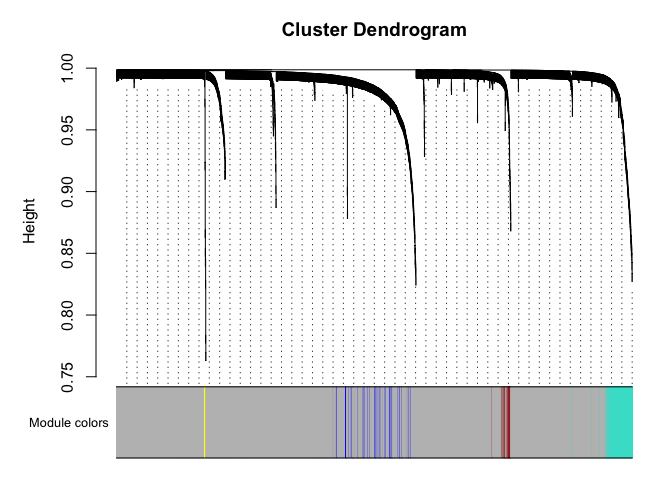
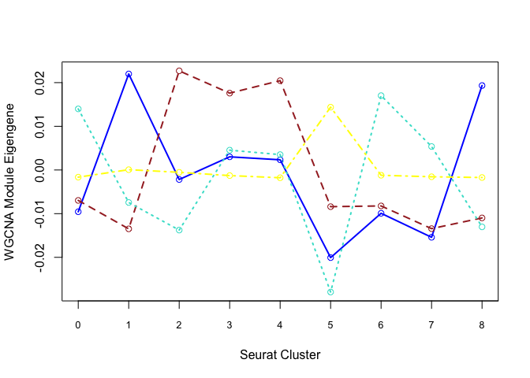

# Setup additinal options


## Load libraries

```r
library(Seurat)
library(ggplot2)
library(limma)
library(topGO)
library(WGCNA)
```

## Load the Seurat object

```r
load("clusters_seurat_object.RData")
experiment.merged
```

<div class='r_output'> An object of class Seurat 
 36601 features across 4000 samples within 1 assay 
 Active assay: RNA (36601 features, 2000 variable features)
  3 dimensional reductions calculated: pca, tsne, umap
</div>
```r
Idents(experiment.merged) <- "RNA_snn_res.0.25"
```


#1. DE With Single Cell Data Using Limma
For differential expression using models more complex than those allowed by FindMarkers() and FindAllMarkers(), data from Seurat may be used in limma (https://www.bioconductor.org/packages/devel/bioc/vignettes/limma/inst/doc/usersguide.pdf)

We illustrate by comparing sample 1 to sample 2 within cluster 0:

```r
cluster0 <- subset(experiment.merged, idents = '0')
expr <- as.matrix(GetAssayData(cluster0))

# Filter out genes that are 0 for every cell in this cluster
bad <- which(rowSums(expr) == 0)
expr <- expr[-bad,]

mm <- model.matrix(~0 + orig.ident, data = cluster0@meta.data)
fit <- lmFit(expr, mm)  
head(coef(fit)) # means in each sample for each gene
```

<div class='r_output'>            orig.identPBMC2 orig.identPBMC3 orig.identT021PBMC orig.identT022PBMC
 AL627309.5      0.00000000      0.09278631        0.005032979        0.014975512
 LINC01409       0.00000000      0.00000000        0.006526071        0.018558404
 LINC01128       0.08781332      0.00000000        0.052129308        0.095441205
 LINC00115       0.00000000      0.00000000        0.007809674        0.013766512
 NOC2L           0.07264820      0.16756185        0.307752834        0.227656257
 KLHL17          0.00000000      0.00000000        0.025409443        0.006485163
</div>
```r
contr <- makeContrasts(orig.identPBMC2 - orig.identPBMC3, levels = colnames(coef(fit)))
tmp <- contrasts.fit(fit, contrasts = contr)
tmp <- eBayes(tmp)
topTable(tmp, sort.by = "P", n = 20) # top 20 DE genes
```

<div class='r_output'>                logFC     AveExpr         t       P.Value     adj.P.Val         B
 RPS4Y1    -1.6532336 0.029174711 -38.37491 6.168119e-200 1.013607e-195 440.65923
 CEBPD     -1.1289309 0.037652250 -18.77288  9.638959e-68  7.919851e-64 142.62775
 SERPINA1  -1.1174456 0.042681254 -16.06871  5.999411e-52  3.286278e-48 106.87221
 LGALS2    -0.4961211 0.011020581 -15.82609  1.341377e-50  5.510713e-47 103.81744
 LILRA5    -0.5602333 0.014666118 -15.66319  1.063496e-49  3.495285e-46 101.78198
 TGFBI     -0.4262776 0.009827447 -15.39643  3.069136e-48  8.405851e-45  98.47652
 CLEC4E    -0.3079079 0.005433668 -15.22063  2.760467e-47  6.480394e-44  96.31723
 LILRB4    -0.3351893 0.008226769 -13.83378  5.236409e-40  1.075624e-36  79.84697
 GSTM1     -0.1853675 0.003271191 -13.73878  1.587677e-39  2.898921e-36  78.75711
 FCGR1A    -0.5509186 0.019832909 -13.70434  2.370812e-39  3.895956e-36  78.36316
 TFEC      -0.1805076 0.003185429 -13.65113  4.397924e-39  6.570099e-36  77.75607
 CD163     -0.4707119 0.011977161 -13.42900  5.700493e-38  7.806350e-35  75.23907
 UTY       -0.3960341 0.006988838 -13.19011  8.679830e-37  1.097197e-33  72.56418
 CD302     -0.3996428 0.011492329 -13.03015  5.273315e-36  6.189741e-33  70.79203
 IFI27     -1.9442354 0.139050432 -12.93048  1.610449e-35  1.764301e-32  69.69554
 RBP7      -0.3308949 0.005839322 -12.62239  4.885460e-34  5.017672e-31  66.34458
 SLC7A7    -0.3248241 0.008875956 -12.49177  2.039404e-33  1.971384e-30  64.94151
 LINC01637 -0.2645501 0.004668531 -12.16772  6.742679e-32  6.155692e-29  61.50714
 IGSF6     -0.4268268 0.014385703 -11.86693  1.632486e-30  1.411928e-27  58.37941
 IL1R2     -0.1930660 0.003407048 -11.57706  3.327906e-29  2.619763e-26  55.42127
</div>* logFC: log2 fold change (UCD_Supp_VitE/UCD_Adj_VitE)
* AveExpr: Average expression, in log2 counts per million, across all cells included in analysis (i.e. those in cluster 0)
* t: t-statistic, i.e. logFC divided by its standard error
* P.Value: Raw p-value from test that logFC differs from 0
* adj.P.Val: Benjamini-Hochberg false discovery rate adjusted p-value

The limma vignette linked above gives more detail on model specification.

# 2. Gene Ontology (GO) Enrichment of Genes Expressed in a Cluster

```r
# install org.Hs.eg.db from Bioconductor if not already installed (for mouse only)
cluster0 <- subset(experiment.merged, idents = '0')
expr <- as.matrix(GetAssayData(cluster0))
# Filter out genes that are 0 for every cell in this cluster
bad <- which(rowSums(expr) == 0)
expr <- expr[-bad,]

# Select genes that are expressed > 0 in at least 75% of cells (somewhat arbitrary definition)
n.gt.0 <- apply(expr, 1, function(x)length(which(x > 0)))
expressed.genes <- rownames(expr)[which(n.gt.0/ncol(expr) >= 0.5)]
all.genes <- rownames(expr)

# define geneList as 1 if gene is in expressed.genes, 0 otherwise
geneList <- ifelse(all.genes %in% expressed.genes, 1, 0)
names(geneList) <- all.genes

# Create topGOdata object
	GOdata <- new("topGOdata",
		ontology = "BP", # use biological process ontology
		allGenes = geneList,
		geneSelectionFun = function(x)(x == 1),
              annot = annFUN.org, mapping = "org.Hs.eg.db", ID = "symbol")
# Test for enrichment using Fisher's Exact Test
	resultFisher <- runTest(GOdata, algorithm = "elim", statistic = "fisher")
	GenTable(GOdata, Fisher = resultFisher, topNodes = 20, numChar = 60)
```

<div class='r_output'>         GO.ID                                                            Term Annotated Significant Expected  Fisher
 1  GO:0006614     SRP-dependent cotranslational protein targeting to membrane        95          80     5.28 < 1e-30
 2  GO:0006413                                        translational initiation       184         101    10.24 < 1e-30
 3  GO:0000184 nuclear-transcribed mRNA catabolic process, nonsense-mediate...       119          81     6.62 < 1e-30
 4  GO:0019083                                             viral transcription       174          81     9.68 < 1e-30
 5  GO:0002181                                         cytoplasmic translation        92          49     5.12 6.8e-29
 6  GO:0035722                       interleukin-12-mediated signaling pathway        43          20     2.39 1.7e-14
 7  GO:0060337                             type I interferon signaling pathway        74          24     4.12 6.4e-13
 8  GO:0006123        mitochondrial electron transport, cytochrome c to oxygen        15          10     0.83 6.2e-10
 9  GO:0016032                                                   viral process       744         167    41.39 1.4e-09
 10 GO:0042776            mitochondrial ATP synthesis coupled proton transport        21          11     1.17 3.1e-09
 11 GO:0000027                                ribosomal large subunit assembly        27          12     1.50 6.4e-09
 12 GO:0000381        regulation of alternative mRNA splicing, via spliceosome        53          16     2.95 1.5e-08
 13 GO:0043066                        negative regulation of apoptotic process       621          77    34.54 4.6e-08
 14 GO:0043312                                        neutrophil degranulation       416          51    23.14 7.5e-08
 15 GO:0002479 antigen processing and presentation of exogenous peptide ant...        71          17     3.95 2.3e-07
 16 GO:0006364                                                 rRNA processing       206          36    11.46 3.0e-07
 17 GO:0000398                                  mRNA splicing, via spliceosome       313          52    17.41 4.3e-07
 18 GO:0002480 antigen processing and presentation of exogenous peptide ant...         8           6     0.45 7.4e-07
 19 GO:0001732         formation of cytoplasmic translation initiation complex        16           8     0.89 7.6e-07
 20 GO:0000028                                ribosomal small subunit assembly        16           8     0.89 7.6e-07
</div>* Annotated: number of genes (out of all.genes) that are annotated with that GO term
* Significant: number of genes that are annotated with that GO term and meet our criteria for "expressed"
* Expected: Under random chance, number of genes that would be expected to be annotated with that GO term and meeting our criteria for "expressed"
* Fisher: (Raw) p-value from Fisher's Exact Test

#3. Weighted Gene Co-Expression Network Analysis (WGCNA)
WGCNA identifies groups of genes ("modules") with correlated expression.
WARNING: TAKES A LONG TIME TO RUN

```r
options(stringsAsFactors = F)
datExpr <- t(as.matrix(GetAssayData(experiment.merged)))[,VariableFeatures(experiment.merged)]  # only use variable genes in analysis

net <- blockwiseModules(datExpr, power = 10,
  corType = "bicor", # use robust correlation
	networkType = "signed", minModuleSize = 10,
	reassignThreshold = 0, mergeCutHeight = 0.15,
	numericLabels = F, pamRespectsDendro = FALSE,
	saveTOMs = TRUE,
	saveTOMFileBase = "TOM",
	verbose = 3)
```

<div class='r_output'>  Calculating module eigengenes block-wise from all genes
    Flagging genes and samples with too many missing values...
     ..step 1
  ..Working on block 1 .
     TOM calculation: adjacency..
     ..will not use multithreading.
      Fraction of slow calculations: 0.000000
     ..connectivity..
     ..matrix multiplication (system BLAS)..
     ..normalization..
     ..done.
    ..saving TOM for block 1 into file TOM-block.1.RData
  ....clustering..
  ....detecting modules..
  ....calculating module eigengenes..
  ....checking kME in modules..
      ..removing 5 genes from module 6 because their KME is too low.
      ..removing 1 genes from module 7 because their KME is too low.
      ..removing 4 genes from module 8 because their KME is too low.
      ..removing 8 genes from module 9 because their KME is too low.
  ..merging modules that are too close..
      mergeCloseModules: Merging modules whose distance is less than 0.15
        Calculating new MEs...
</div>
```r
table(net$colors)
```

<div class='r_output'> 
      blue     brown      grey turquoise    yellow 
        22        20      1911        28        19
</div>
```r
# Convert labels to colors for plotting
mergedColors = net$colors
# Plot the dendrogram and the module colors underneath
plotDendroAndColors(net$dendrograms[[1]], mergedColors[net$blockGenes[[1]]],
"Module colors",
dendroLabels = FALSE, hang = 0.03,
addGuide = TRUE, guideHang = 0.05)
```

<!-- -->
Genes in grey module are unclustered.

What genes are in the "blue" module?

```r
colnames(datExpr)[net$colors == "blue"]
```

<div class='r_output'>  [1] "HBB"        "HBA2"       "HBA1"       "ALAS2"      "HBD"        "AHSP"       "CA1"        "HBM"        "SNCA"       "IFIT1B"     "SLC4A1"     "SELENBP1"   "EPB42"      "PHOSPHO1"   "HEMGN"      "HBQ1"       "DCAF12"     "SLC25A39"   "OR2W3"      "KLC3"       "AC130456.3" "GYPB"
</div>
Each cluster is represented by a summary "eigengene".
Plot eigengenes for each non-grey module by clusters from Seurat:

```r
f <- function(module){
  eigengene <- unlist(net$MEs[paste0("ME", module)])
  means <- tapply(eigengene, Idents(experiment.merged), mean, na.rm = T)
  return(means)
}
unique(net$colors)
```

<div class='r_output'> [1] "blue"      "grey"      "yellow"    "brown"     "turquoise"
</div>
```r
modules <- c("blue", "brown", "turquoise", "yellow")
plotdat <- sapply(modules, f)
matplot(plotdat, col = modules, type = "l", lwd = 2, xaxt = "n", xlab = "Seurat Cluster",
        ylab = "WGCNA Module Eigengene")
axis(1, at = 1:19, labels = 0:18, cex.axis = 0.8)
matpoints(plotdat, col = modules, pch = 21)
```

<!-- -->

Can also plot the module onto the tsne plot

```r
blue.eigengene <- unlist(net$MEs[paste0("ME", "blue")])
names(blue.eigengene) <- rownames(datExpr)
experiment.merged$blue.eigengene <- blue.eigengene
FeaturePlot(experiment.merged, features = "blue.eigengene", cols = c("grey", "blue"))
```

<!-- -->


## Session Information

```r
sessionInfo()
```

<div class='r_output'> R version 4.0.3 (2020-10-10)
 Platform: x86_64-apple-darwin17.0 (64-bit)
 Running under: macOS Big Sur 10.16
 
 Matrix products: default
 BLAS:   /Library/Frameworks/R.framework/Versions/4.0/Resources/lib/libRblas.dylib
 LAPACK: /Library/Frameworks/R.framework/Versions/4.0/Resources/lib/libRlapack.dylib
 
 locale:
 [1] en_US.UTF-8/en_US.UTF-8/en_US.UTF-8/C/en_US.UTF-8/en_US.UTF-8
 
 attached base packages:
 [1] stats4    parallel  stats     graphics  grDevices utils     datasets  methods   base     
 
 other attached packages:
  [1] org.Hs.eg.db_3.11.4   WGCNA_1.70-3          fastcluster_1.1.25    dynamicTreeCut_1.63-1 topGO_2.40.0          SparseM_1.81          GO.db_3.11.4          AnnotationDbi_1.50.3  IRanges_2.22.2        S4Vectors_0.26.1      Biobase_2.48.0        graph_1.66.0          BiocGenerics_0.34.0   limma_3.44.3          ggplot2_3.3.3         SeuratObject_4.0.0    Seurat_4.0.1         
 
 loaded via a namespace (and not attached):
   [1] backports_1.2.1       Hmisc_4.5-0           plyr_1.8.6            igraph_1.2.6          lazyeval_0.2.2        splines_4.0.3         listenv_0.8.0         scattermore_0.7       digest_0.6.27         foreach_1.5.1         htmltools_0.5.1.1     fansi_0.4.2           checkmate_2.0.0       magrittr_2.0.1        memoise_2.0.0         tensor_1.5            cluster_2.1.1         doParallel_1.0.16     ROCR_1.0-11           globals_0.14.0       
  [21] matrixStats_0.58.0    spatstat.sparse_2.0-0 jpeg_0.1-8.1          colorspace_2.0-0      blob_1.2.1            ggrepel_0.9.1         xfun_0.22             dplyr_1.0.5           crayon_1.4.1          jsonlite_1.7.2        spatstat.data_2.1-0   impute_1.62.0         survival_3.2-10       zoo_1.8-9             iterators_1.0.13      glue_1.4.2            polyclip_1.10-0       gtable_0.3.0          leiden_0.3.7          future.apply_1.7.0   
  [41] abind_1.4-5           scales_1.1.1          DBI_1.1.1             miniUI_0.1.1.1        Rcpp_1.0.6            htmlTable_2.1.0       viridisLite_0.3.0     xtable_1.8-4          reticulate_1.18       spatstat.core_1.65-5  foreign_0.8-81        bit_4.0.4             preprocessCore_1.50.0 Formula_1.2-4         htmlwidgets_1.5.3     httr_1.4.2            RColorBrewer_1.1-2    ellipsis_0.3.1        ica_1.0-2             farver_2.1.0         
  [61] pkgconfig_2.0.3       nnet_7.3-15           sass_0.3.1            uwot_0.1.10           deldir_0.2-10         utf8_1.2.1            labeling_0.4.2        tidyselect_1.1.0      rlang_0.4.10          reshape2_1.4.4        later_1.1.0.1         munsell_0.5.0         tools_4.0.3           cachem_1.0.4          generics_0.1.0        RSQLite_2.2.4         ggridges_0.5.3        evaluate_0.14         stringr_1.4.0         fastmap_1.1.0        
  [81] yaml_2.2.1            goftest_1.2-2         knitr_1.31            bit64_4.0.5           fitdistrplus_1.1-3    purrr_0.3.4           RANN_2.6.1            pbapply_1.4-3         future_1.21.0         nlme_3.1-152          mime_0.10             rstudioapi_0.13       compiler_4.0.3        plotly_4.9.3          png_0.1-7             spatstat.utils_2.1-0  tibble_3.1.0          bslib_0.2.4           stringi_1.5.3         highr_0.8            
 [101] lattice_0.20-41       Matrix_1.3-2          vctrs_0.3.6           pillar_1.5.1          lifecycle_1.0.0       spatstat.geom_2.0-1   lmtest_0.9-38         jquerylib_0.1.3       RcppAnnoy_0.0.18      data.table_1.14.0     cowplot_1.1.1         irlba_2.3.3           httpuv_1.5.5          patchwork_1.1.1       latticeExtra_0.6-29   R6_2.5.0              promises_1.2.0.1      KernSmooth_2.23-18    gridExtra_2.3         parallelly_1.24.0    
 [121] codetools_0.2-18      MASS_7.3-53.1         assertthat_0.2.1      withr_2.4.1           sctransform_0.3.2     mgcv_1.8-34           grid_4.0.3            rpart_4.1-15          tidyr_1.1.3           rmarkdown_2.7         Rtsne_0.15            base64enc_0.1-3       shiny_1.6.0
</div>